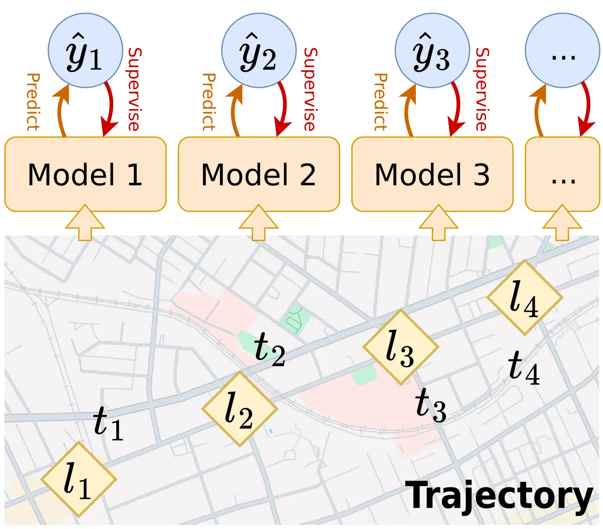
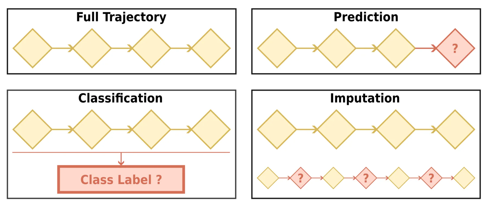

+++
title = "End-to-end Learning of Spatiotemporal Trajectories"
date = 2026-02-02
description = ""
+++

End-to-end learning means training a model to perform a task from input to output, supervising only on how the output aligns with the task's ground truth.
End-to-end is typically the most straightforward option for building a deep learning method for a certain task, and that also applies to most tasks related to spatiotemporal trajectories.

> Illustration of end-to-end learning of spatiotemporal trajectories.

In this post we will categorize end-to-end learning tasks of trajectories from a technical standpoint: prediction, classification, and imputation.
For each category of tasks, we will give a general problem formulation and the general framework for solving it, and briefly discuss the motivation and use case of more specific downstream applications that fit into the category.

> Schema overview of the three categories of end-to-end trajectory learning tasks.

## Trajectory Prediction

Recall in the [introduction post](@/dl4traj/introduction/index.md) that a complete trajectory usually records the movement of the target from the beginning to the end of the movement process.
In trajectory prediction, we assume only the earlier part of the trajectory is available, and we want to know what comes next.

### Problem Formulation: Mapping History to Future

Trajectory prediction can be formulated as a conditional sequence prediction problem.
Given the earlier part of a trajectory, the goal is to predict the later part.
The prediction target can be a portion or all of the trajectory point's feature set: only the location, only the timestamp, both location and timestamp, or additional features like road segment ID.
Depending on the prediction horizon, we distinguish two main variants.

In _multi-to-one prediction_, the model predicts a single trajectory point (or a subset of its features) given the earlier part. Let the input trajectory be $\mathcal{T}\_{1:m} = \langle (l_1, t_1), (l_2, t_2), \ldots, (l_m, t_m) \rangle$ out of a complete trajectory with $n$ points, where $m < n$. The goal is to learn a mapping:

$$f_\theta: \mathcal{T}\_{1:m} \rightarrow p\_{\text{target}}$$

When $p\_{\text{target}}$ corresponds to the $(m+1)$-th point, this is next-location prediction. When $p\_{\text{target}}$ corresponds to the $n$-th point (the final point of the complete trajectory), this is destination prediction.

In _multi-to-multi prediction_, the model predicts a sequence of trajectory points. There are two common setups. The first is to predict all remaining points from $m+1$ to $n$:

$$f_\theta: \mathcal{T}\_{1:m} \rightarrow \mathcal{T}\_{m+1:n}$$

The second is a sliding window setup, where trajectories are segmented into fixed-length history-prediction pairs. Given a history window of length $h$ and a prediction window of length $k$, each sample has the form:

$$f_\theta: \mathcal{T}\_{i:i+h} \rightarrow \mathcal{T}\_{i+h+1:i+h+k}$$

This is similar to time series forecasting and allows for training on multiple segments from each trajectory.

### Evaluation Metrics: Measuring Prediction Error

Evaluation metrics depend on how the prediction target is represented.

When prediction targets are continuous, _error-based metrics_ are used. For spatial coordinates, average displacement error (ADE) measures the mean Euclidean distance across all predicted points, while final displacement error (FDE) measures the distance at the last predicted point:

$$\text{ADE} = \frac{1}{K} \sum_{j=1}^{K} \| \hat{l}_j - l_j \|_2$$

$$\text{FDE} = \| \hat{l}_K - l_K \|_2$$

where $K$ is the number of predicted points. For multi-to-one prediction, $K=1$ and ADE equals FDE.
For continuous time features (e.g., travel time relative to the start of the trajectory), mean absolute error (MAE) or root mean squared error (RMSE) are commonly used.

When prediction targets are discrete (locations as POIs, road segments, or grid cells; timestamps as hours of the day), _classification metrics_ are used. Accuracy measures the proportion of correct predictions, while Top-K hit rate measures whether the ground truth appears among the K most likely predictions:

$$\text{Acc} = \frac{1}{N} \sum_{i=1}^{N} \mathbb{I}(\hat{y}_i = y_i)$$

$$\text{Top-}K = \frac{1}{N} \sum_{i=1}^{N} \mathbb{I}(y_i \in \text{Top-}K(\hat{\mathbf{p}}_i))$$

where $y_i$ is the ground truth target and $\hat{\mathbf{p}}_i$ is the predicted probability distribution for sample $i$.
Other standard classification metrics like precision, recall, and F1 score are also applicable.

Depending on the prediction target and information available, more complex trajectory-specific metrics can also be used.
For example, when the prediction target is a location on the road network (road segment ID + ratio of progression on the segment), the shortest path distance on the road network between the prediction and ground truth can be used instead of Euclidean distance.
When predicting multiple trajectory points, trajectory similarity measurements like dynamic time warping (DTW) can be used to compare the predicted and ground truth sequences.

### General Framework: Encoder-Predictor

A trajectory prediction deep learning model typically follows a two-stage architecture: an encoder that transforms the input trajectory into latent representations, followed by a prediction head that outputs the target.

The _encoder_ takes the input trajectory $\mathcal{T}\_{1:m}$ and produces latent representations. This can be a single vector $\mathbf{h} \in \mathbb{R}^d$ summarizing the entire input trajectory, or a sequence of vectors $\mathbf{H} = (\mathbf{h}\_1, \mathbf{h}\_2, \ldots, \mathbf{h}\_m)$ where each $\mathbf{h}\_i$ corresponds to an input point.

The _prediction head_ maps latent representations to outputs.
For multi-to-one prediction, this is typically a feedforward network that projects the final hidden state (or a pooled representation) to the target space:

$$\hat{p}\_{\text{target}} = \text{MLP}(\mathbf{h}\_m) \quad \text{or} \quad \hat{p}\_{\text{target}} = \text{MLP}(\text{Pool}(\mathbf{H}))$$

For multi-to-multi prediction, there are two main decoding strategies. Autoregressive (AR) decoding generates one point at a time, feeding each prediction back as input to generate the next:

$$\hat{p}\_{t+1} = f\_\theta(\mathbf{H}, \hat{p}\_1, \ldots, \hat{p}\_t)$$

This naturally enforces sequential dependencies and tends to produce smoother trajectories, but errors can accumulate as mistakes in early predictions propagate forward.
Non-autoregressive decoding outputs all points simultaneously, either through a decoder that attends to the encoder representations, or through separate prediction heads for each target point. This avoids error accumulation but may produce less coherent trajectories, for example, trajectories that are physically impossible or unreasonable.

When the target includes multiple features with different types, separate prediction heads are used for each. For example, a regression head for continuous features like coordinates, and a classification head with softmax output for discrete features like POI identifiers.

Training of the deep learning model involves minimizing a loss function comparing predictions to ground truth targets. For continuous targets like coordinates, _regression losses_ are used, like MSE:

$$\mathcal{L}\_{\text{MSE}} = \frac{1}{K} \sum\_{j=1}^{K} \| \hat{l}\_j - l\_j \|\_2^2$$

Other regression losses like L1 (MAE) and Huber loss can also be used depending on the desired sensitivity to outliers.
For discrete targets, _cross-entropy loss_ measures the divergence between predicted probabilities and ground truth labels:

$$\mathcal{L}\_{\text{CE}} = -\frac{1}{K} \sum\_{j=1}^{K} \log P(\hat{y}\_j = y\_j)$$

When predicting multiple features, the total loss is a weighted sum of individual losses.

> When training autoregressive models, there are different strategies for what to feed as decoder input. One option is to always feed ground truth previous points, which stabilizes training but creates a distribution mismatch: during inference the model must condition on its own predictions, which may differ from the ground truth it was trained on. Another option is to always use the model's own predictions during both training and inference. A common mixed strategy is to start with ground truth inputs and gradually switch to model predictions as training progresses.

### Downstream Applications: Anticipating Movement

Trajectory prediction has broad applications across domains where anticipating future movement enables better decision-making.

In autonomous driving and robotics, _predicting the future positions_ of pedestrians, vehicles, and other agents is essential for safe navigation and motion planning.
Given the observed trajectory of a nearby pedestrian $\mathcal{T}\_{1:m}$, an autonomous vehicle must predict the pedestrian's future path $\mathcal{T}\_{m+1:m+k}$ over the next few seconds to plan a collision-free route. This is typically formulated as multi-to-multi prediction with a sliding window: the history window covers the recent past (e.g., 2-3 seconds of observations), and the prediction window covers the planning horizon (e.g., 3-5 seconds into the future). The prediction target is usually continuous spatial coordinates, evaluated using ADE and FDE.
Similar formulations apply to aircraft collision avoidance systems that predict flight paths and maritime applications that forecast ship trajectories for tactical planning.

_Destination prediction_ is useful when a vehicle's intended endpoint is unknown to the observer. For example, traffic management systems monitoring vehicle flows may want to predict where each vehicle is heading based on its observed trajectory $\mathcal{T}\_{1:m}$, enabling proactive congestion control or infrastructure planning. This is a multi-to-one prediction problem where $p\_{\text{target}} = l_n$. The destination is often represented as a discrete location (a predefined zone or road segment), making it a classification task.

_Arrival time estimation_ predicts when the destination will be reached based on the trip so far: $p\_{\text{target}} = t_n - t_1$, the total trip duration. This is a regression task where the model learns $f_\theta: \mathcal{T}\_{1:m} \rightarrow \Delta t$, typically evaluated using MAE or RMSE. Ride-hailing platforms use this to provide accurate ETAs that update as the trip progresses. In some formulations, the destination is known in advance, so the input includes both the observed trajectory and the target location.

Location-based services might implement _next POI recommendation_ by predicting which point of interest (POI) a user will visit next based on their check-in history.
A user's past visits form a trajectory $\mathcal{T}\_{1:m}$ where each location $l_i$ is a POI identifier and each timestamp $t_i$ indicates when the visit occurred. The task is to predict the next POI: $f_\theta: \mathcal{T}\_{1:m} \rightarrow l\_{m+1}$, a multi-to-one classification problem over the set of candidate POIs. This enables applications like personalized venue suggestions and location-aware advertising. Top-K hit rate is a common evaluation metric, reflecting whether the ground truth POI appears among the top recommendations.

> **Representative Works:**
> - Kong, Dejiang, and Fei Wu. “HST-LSTM: A Hierarchical Spatial-Temporal Long-Short Term Memory Network for Location Prediction.”
> - Liang, Yuebing, and Zhan Zhao. “NetTraj: A Network-Based Vehicle Trajectory Prediction Model With Directional Representation and Spatiotemporal Attention Mechanisms.”
> - Wu, Hao, Ziyang Chen, Weiwei Sun, Baihua Zheng, and Wei Wang. “Modeling Trajectories with Recurrent Neural Networks.”
> - Yan, Bingqi, Geng Zhao, Lexue Song, Yanwei Yu, and Junyu Dong. “PreCLN: Pretrained-Based Contrastive Learning Network for Vehicle Trajectory Prediction.”

## Trajectory Classification

Unlike trajectory prediction where only the earlier part of a trajectory is available, trajectory classification assumes access to the complete trajectory and aims to infer properties not directly recorded in the data.

### Problem Formulation: Mapping Trajectories to Labels

Trajectory classification can be formulated as mapping trajectories or their components to predefined categories. Let $\mathcal{C} = \{c_1, c_2, \ldots, c_K\}$ be the set of $K$ possible classes. Depending on the granularity of classification, we distinguish two main variants.

In _trajectory-level classification_, the model assigns a single label to an entire trajectory. Given a complete trajectory $\mathcal{T} = \langle (l_1, t_1), (l_2, t_2), \ldots, (l_n, t_n) \rangle$, the goal is to learn a mapping:

$$f_\theta: \mathcal{T} \rightarrow c \in \mathcal{C}$$

The class label typically represents a property of the trajectory as a whole, such as transportation mode or the user who generated it.

In _point-level classification_, the model assigns a label to each trajectory point. Given a trajectory with $n$ points, the goal is to learn:

$$f_\theta: \mathcal{T} \rightarrow (c_1, c_2, \ldots, c_n) \quad \text{where } c_i \in \mathcal{C}$$

This produces a sequence of labels aligned with the trajectory, which is useful for segmentation tasks where the goal is to identify boundaries between different movement phases.

A related variant is _subtrajectory-level classification_, where contiguous segments of a trajectory are classified rather than individual points. This can be viewed as point-level classification followed by grouping consecutive points with the same label, or as a joint segmentation-and-classification problem where the model must both identify segment boundaries and assign labels to each segment.

### Evaluation Metrics: Standard and Boundary Metrics

Since trajectory classification produces discrete labels, standard classification metrics apply. Accuracy, precision, recall, F1 score, and Top-K hit rate are all applicable, as introduced in the evaluation metrics of trajectory prediction above.
For trajectory-level classification, metrics are computed over the set of trajectories. For point-level classification, metrics are typically computed over all points across all trajectories, treating each point as an individual sample.

For subtrajectory-level classification that involves explicit segmentation of the trajectory, additional metrics may evaluate boundary detection quality. A boundary is a point where the label changes from one class to another. Boundary precision measures what fraction of predicted boundaries are correct, while boundary recall measures what fraction of true boundaries are detected:

$$\text{Precision} = \frac{|\hat{B} \cap B|}{|\hat{B}|}, \quad \text{Recall} = \frac{|\hat{B} \cap B|}{|B|}$$

where $B$ is the set of true boundary positions and $\hat{B}$ is the set of predicted boundaries. Since the exact transition point can be ambiguous (e.g., when does "walking to the bus stop" become "riding the bus"?), a predicted boundary can be considered correct if it falls within a few trajectory points of a true boundary.

### General Framework: Encoder-Classifier

Trajectory classification models share a similar encoder-head architecture with trajectory prediction, but differ in how the encoder output is used and what the head produces.

The _encoder_ takes the complete trajectory $\mathcal{T}$ and produces latent representations. For trajectory-level classification, we need a single vector $\mathbf{h} \in \mathbb{R}^d$ representing the entire trajectory. This can be obtained by applying a pooling operation over point-wise representations, or by using the final hidden state of a sequential encoder.
For point-level classification, we need a sequence of vectors $\mathbf{H} = (\mathbf{h}\_1, \mathbf{h}\_2, \ldots, \mathbf{h}\_n)$ where each $\mathbf{h}\_i$ captures context relevant for classifying point $i$.
Since labels often depend on surrounding context (e.g., determining transportation mode requires mining movement patterns over multiple points), bidirectional encoders that aggregate information from both past and future points are commonly used.

The _classification head_ maps latent representations to class probabilities. For trajectory-level classification, a feedforward network with softmax output produces a distribution over classes:

$$\hat{\mathbf{p}} = \text{Softmax}(\text{MLP}(\mathbf{h}))$$

where $\hat{\mathbf{p}} \in \mathbb{R}^K$ and $\hat{p}\_k$ represents the predicted probability of class $c\_k$. The predicted class is $\hat{c} = \arg\max\_k \hat{p}\_k$.

For point-level classification, the same classification head is applied to each point's representation independently:

$$\hat{\mathbf{p}}\_i = \text{Softmax}(\text{MLP}(\mathbf{h}\_i))$$

This produces a sequence of label predictions $(\hat{c}\_1, \hat{c}\_2, \ldots, \hat{c}\_n)$. The shared weights across points allow the model to learn general patterns while the encoder provides point-specific context.

For subtrajectory-level classification, directly using point-level classification can produce noisy results where the predicted label frequently switches back and forth.
One approach is to add a _boundary detection head_ that performs binary classification at each point, predicting whether a segment transition occurs there:

$$\hat{b}\_i = \sigma(\text{MLP}(\mathbf{h}\_i)) \in [0, 1]$$

The detected boundaries partition the trajectory into segments. Each segment can then be classified as a whole or by aggregating point-level predictions within it.
Another approach is to use a _conditional random field (CRF)_ layer on top of the neural network. The CRF models the joint probability of the label sequence by incorporating learned transition scores $\psi(c\_i, c\_{i+1})$ that capture how likely class $c\_{i+1}$ is to follow $c\_i$. These scores discourage rapid label switching, producing smoother segmentations.

Training uses cross-entropy loss as described earlier. For trajectory-level classification, the loss is computed per trajectory; for point-level classification, it is averaged over all points.

### Downstream Applications: Inferring Hidden Attributes

Trajectory classification enables inferring properties of movement that are not directly recorded but can be learned from the spatiotemporal patterns.

_Transportation mode detection_ identifies how a person or vehicle is traveling based on their trajectory.
Given a trajectory $\mathcal{T}$, the task is to predict the transportation mode $c \in \mathcal{C}$ where $\mathcal{C}$ might include walk, bike, car, bus, and train. When the entire trajectory uses a single mode, this is trajectory-level classification: $f_\theta: \mathcal{T} \rightarrow c$.
When a trajectory spans multiple modes (e.g., walking to a bus stop, taking the bus, then walking to the destination), point-level or subtrajectory-level classification applies: $f_\theta: \mathcal{T} \rightarrow (c_1, c_2, \ldots, c_n)$. This information is valuable for urban mobility analysis, carbon footprint estimation, and transportation infrastructure planning.

_Trajectory-user linking_ determines which user generated a given trajectory based on movement patterns.
Let $\mathcal{U} = \{u_1, u_2, \ldots, u_K\}$ be a set of $K$ users. Given a trajectory $\mathcal{T}$ from an unknown user, the task is to identify which user generated it: $f_\theta: \mathcal{T} \rightarrow u \in \mathcal{U}$.
This is trajectory-level classification where the classes are user identities. The model learns to recognize individual mobility patterns from historical trajectories of each user.

> **Representative Works:**
> - Liang, Yuxuan, Kun Ouyang, Yiwei Wang, et al. “TrajFormer: Efficient Trajectory Classification with Transformers.”
> - Sang, Yu, Zhenping Xie, Wei Chen, and Lei Zhao. “TULRN: Trajectory User Linking on Road Networks.”
> - Luo, Kang, Yuanshao Zhu, Wei Chen, et al. “Towards Robust Trajectory Representations: Isolating Environmental Confounders with Causal Learning.”

## Trajectory Imputation

Trajectory imputation aims to infer a trajectory with a higher sample rate (or a shorter sample interval) than the currently available trajectory.
It is essentially a super-resolution task for trajectories.

### Problem Formulation: From Sparse to Dense

Trajectory imputation can be formulated as mapping a sparsely sampled trajectory to a more densely sampled one. Given an input trajectory $\mathcal{T} = \langle (l_1, t_1), (l_2, t_2), \ldots, (l_n, t_n) \rangle$ with $n$ points, the goal is to produce a target trajectory $\mathcal{T}' = \langle (l'_1, t'_1), (l'_2, t'_2), \ldots, (l'_m, t'_m) \rangle$ with $m > n$ points that represents the same underlying movement at a higher temporal resolution. The first and last points are typically shared between input and target: $(l'_1, t'_1) = (l_1, t_1)$ and $(l'_m, t'_m) = (l_n, t_n)$.

In most formulations, the timestamps $t'_1, t'_2, \ldots, t'_m$ of the target trajectory are provided as input, since they can be easily obtained through linear interpolation given a desired sample rate. The learning task then becomes predicting the locations at these query timestamps:

$$f_\theta: (\mathcal{T}, \{t'_1, t'_2, \ldots, t'_m\}) \rightarrow \{l'_1, l'_2, \ldots, l'_m\}$$

> A trajectory can be viewed as a discretized recording of continuous movement, and the sample rate is essentially arbitrary. By specifying the target timestamps, we make explicit the resolution at which we want to reconstruct the movement.

The target sample rate is typically a multiple of the input rate, so that input points align with target points. With an upsampling factor of $k$, the model inserts $k-1$ new points between each pair of consecutive input points, giving $m = (n-1) \cdot k + 1$:

$$f_\theta: \mathcal{T} \rightarrow \mathcal{T}' \quad \text{where } t'_{(i-1) \cdot k + 1} = t_i \text{ for } i = 1, \ldots, n$$

The target trajectory can also include an expanded feature set beyond what is available in the input. For example, when the input trajectory is sampled too sparsely, features like road segment ID may be unavailable because the sampling interval is larger than typical road segment lengths. The imputation model can predict these additional features for the denser target trajectory, avoiding the need for separate post-processing steps like map matching.

### Evaluation Metrics: Measuring Reconstruction Quality

Since the primary output of trajectory imputation is a sequence of predicted locations, evaluation uses the same error-based metrics as trajectory prediction: ADE for point-wise accuracy and trajectory similarity measures like DTW for overall shape fidelity. When the upsampling factor is an integer, input points that coincide with target points are excluded from evaluation.

When the target trajectory includes additional features beyond raw coordinates, each feature type requires its own evaluation. Discrete features like road segment IDs are evaluated using classification accuracy. When target locations are represented as positions on a road network, the shortest path distance on the road network mentioned above can be used.

### General Framework: Encoder-Decoder

Trajectory imputation models follow a similar encoder-decoder architecture to multi-to-multi trajectory prediction, adapted to handle the query timestamps that specify where new points should be inserted.

The _encoder_ processes the sparse input trajectory $\mathcal{T}$ and produces latent representations $\mathbf{H} = (\mathbf{h}\_1, \mathbf{h}\_2, \ldots, \mathbf{h}\_n)$ for each input point. Since imputation requires understanding the movement pattern across the entire trajectory, bidirectional encoders are commonly used.

The _decoder_ generates location predictions for each query timestamp $t'\_j$ in the target trajectory. Two main decoding strategies apply here, similar to trajectory prediction. Autoregressive decoding generates points sequentially, conditioning each prediction on previously generated points:

$$\hat{l}'\_j = f\_\theta(\mathbf{H}, t'\_j, \hat{l}'\_1, \ldots, \hat{l}'\_{j-1})$$

Non-autoregressive decoding predicts all target locations simultaneously. A common approach uses cross-attention, where queries derived from target timestamps attend to the encoder representations:

$$\hat{l}'\_j = \text{MLP}(\text{CrossAttn}(\text{Embed}(t'\_j), \mathbf{H}))$$

Since imputed points must lie between known input points, their locations are spatially bounded. This constraint can be incorporated explicitly.
One approach is to predict offsets from a baseline interpolation rather than absolute coordinates: given linear interpolation $\bar{l}'\_j$ between surrounding input points, the model predicts a residual $\Delta l'\_j$ such that $\hat{l}'\_j = \bar{l}'\_j + \Delta l'\_j$.
When road network location is part of the target feature set, candidate road segments for classification can be restricted to those within proximity of the surrounding known points.

When the upsampling factor is a fixed integer $k$, an alternative _encoder-only_ architecture becomes possible. The input trajectory is first expanded to the target length $m = (n-1) \cdot k + 1$ by inserting $k-1$ placeholder tokens between each pair of consecutive input points:

$$(l'\_j, t'\_j) = \begin{cases} (l\_i, t\_i) & \text{if } j = (i-1) \cdot k + 1 \text{ for some } i \in \{1, \ldots, n\} \\\ (\texttt{[MASK]}, t'\_j) & \text{otherwise} \end{cases}$$

where $t'\_j$ at masked positions is the interpolated timestamp. The expanded sequence, with original points preserved and new positions marked with learned mask embeddings, is then processed by the encoder. The encoder output at masked positions is passed through a prediction head to obtain the imputed locations:

$$\hat{l}'\_j = \text{MLP}(\mathbf{h}'\_j) \quad \text{for masked positions } j$$

Training uses the same regression and classification losses as trajectory prediction, depending on whether target features are continuous or discrete. When input points are aligned with target points, the loss is typically computed only on the newly imputed points to focus learning on the imputation task rather than reconstruction of known inputs.

### Downstream Applications: Enhancing Resolution

Trajectory imputation is typically considered as a practical application by itself.
Sparse sampling is common in real-world trajectory data due to constraints on GPS polling frequency, battery consumption, storage costs, or privacy considerations. For example, ride-hailing services may record vehicle positions every 30 seconds to reduce data transmission costs, while fitness trackers may lower sampling rates to extend battery life.
Imputation recovers the fine-grained movement details lost to sparse sampling, enabling more accurate map matching, smoother trajectory visualization, and better input for downstream analyses that assume densely sampled data.
In some contexts, trajectory imputation is also referred to as trajectory recovery or trajectory reconstruction.

> **Representative Works:**
> - Xia, Tong, Yunhan Qi, Jie Feng, et al. “AttnMove: History Enhanced Trajectory Recovery via Attentional Network.”
> - Chen, Yuqi, Hanyuan Zhang, Weiwei Sun, and Baihua Zheng. “RNTrajRec: Road Network Enhanced Trajectory Recovery with Spatial-Temporal Transformer.”
> - Wei, Tonglong, Youfang Lin, Yan Lin, Shengnan Guo, Lan Zhang, and Huaiyu Wan. “Micro-Macro Spatial-Temporal Graph-Based Encoder-Decoder for Map-Constrained Trajectory Recovery.”
> - Wei, Tonglong, Yan Lin, Youfang Lin, et al. “PLMTrajRec: A Scalable and Generalizable Trajectory Recovery Method with Pre-Trained Language Models.”

