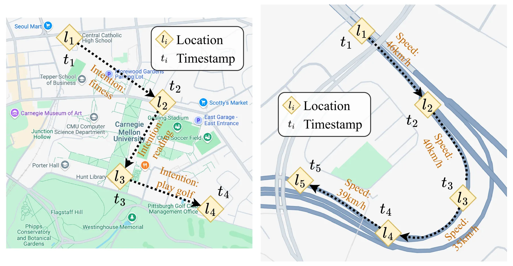
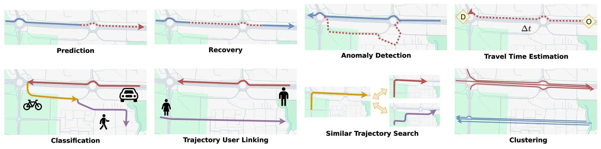

+++
title = "Introduction to Deep Learning for Trajectories"
date = 2026-02-01
description = ""

[extra]
chapter = "1"
+++

A spatiotemporal trajectory is a sequence, with each item being a timestamped location. It records the movement of an object or a human through time and space.

> Examples of human (left) and vehicle (right) trajectories.

With the development of technologies and devices that can record trajectories, such as GPS-equipped mobile phones, human society has gathered large-scale trajectory data.
Such data can be valuable for traffic planning and city development.
Yet, the scale of the data also creates challenges for traditional data analysis approaches.
To automate the process of trajectory data analysis, including feature extraction, embedding learning, performing tasks such as prediction, classification, and imputation, deep learning techniques have increasingly become prominent in the field.

## What is a Trajectory?

A trajectory consists of a sequence of locations, each associated with a timestamp. Together, these points trace the path of a moving object or person through space and time.
A complete trajectory usually records the movement of the target from the beginning to the end of the movement process. For example, a complete taxi trajectory would span from the start of the trip (when the passenger gets into the taxi and the order starts) to the end of the trip (when the passenger gets off the taxi and the order terminates).
Formally, a trajectory can be represented as:

$$\mathcal{T} = \langle (l_1, t_1), (l_2, t_2), \ldots, (l_n, t_n) \rangle$$

where each $(l_i, t_i)$ is a trajectory point containing a location $l_i$ and a timestamp $t_i$.

Timestamps can be recorded in two ways. Absolute timestamps use a standard time reference (e.g., "2025-03-20 07:15:30 UTC"), allowing direct comparison across different trajectories. Relative timestamps record time as an offset from some reference point, such as "10 minutes after departure", which is useful for analyzing recurring patterns like daily commutes.

Locations can be represented in several forms depending on the application:

- 2D/3D coordinates: points $(l_x, l_y)$ or $(l_x, l_y, l_z)$ in a Cartesian coordinate system, such as GPS coordinates $(l_{lat}, l_{lon})$ or local coordinate frames for indoor tracking; altitude $l_{alt}$ may be included for aerial trajectories
- Road network positions: segment identifiers and offsets within a road network, common in navigation systems
- Grid cell IDs: discrete cell indices in a spatial grid partitioning, used when exact coordinates are unavailable or unnecessary
- Points of Interest (POIs): discrete semantic locations such as "Central Station" or "Airport Terminal 2"
- Areas of Interest (AOIs): region identifiers representing larger zones such as neighborhoods, districts, or functional areas

### Types of Trajectories

Trajectories can be broadly categorized based on what is being tracked.

Human trajectories record individual movement patterns, such as walking, cycling, driving, or using public transit. These trajectories reflect daily routines, travel preferences, and activity patterns. They are typically collected through smartphone GPS or location-based services.

Object trajectories track vehicles, goods, or machines. Examples include delivery trucks on logistics routes, drones conducting aerial surveys, ships following maritime lanes, and autonomous vehicles navigating urban environments. These trajectories tend to be more structured, often constrained by road networks or operational protocols.

## How Useful are Trajectories?

### Information in Trajectories

Trajectories carry multiple layers of information. At the basic level, spatial information captures where movement occurs through geographic coordinates and path geometry. Temporal information captures when movement occurs through timestamps and segment durations. When combined, spatiotemporal features like speed and acceleration can reveal how movement dynamics change over time.

Beyond these direct measurements, trajectories encode higher-order information about their environment. Trajectory density and dwell times reveal the functional characteristics of locations, like commercial districts, residential areas, and transit hubs. Speed variations across road networks expose traffic congestion patterns. Differences in mobility patterns between neighborhoods can reflect socioeconomic conditions. Public facility usage, from transit stations to parking lots, becomes visible through trajectory flows.

These layers of information support applications ranging from urban planning and traffic management to environmental monitoring and transportation services.

### Background of Trajectory Learning

The rapid growth of trajectory learning has been driven by technological advances, application demands, and the inherent complexity of trajectory data.

On the technology side, smartphones and IoT devices now generate massive amounts of trajectory data through GPS, Wi-Fi, and cellular positioning. Navigation apps, ride-hailing platforms, and delivery services continuously collect user trajectories. Cloud computing and distributed processing frameworks like Hadoop and Spark have made storing and analyzing this data feasible. Deep learning models, particularly RNNs and Transformers, have proven effective at learning trajectory representations and capturing complex spatiotemporal patterns.

On the application side, trajectory analysis has become essential across multiple domains. Urban planners use it to optimize traffic signals and transit scheduling. Ride-hailing and logistics platforms rely on it for route optimization and demand prediction. Public health agencies leverage trajectory data for disease spread monitoring. Environmental researchers analyze movement patterns to study wildlife migration and urban emissions.

Trajectory data also presents real technical challenges. GPS signals drop in tunnels and urban canyons, creating gaps. Sampling rates vary across devices and services. The same location can mean different things at different times (a restaurant at noon versus a bar at midnight). And patterns that matter for one task (like commute prediction) may be noise for another (like anomaly detection). These challenges make trajectory learning a rich area for research.

### Trajectory-related Tasks

Basic analysis tasks focus on understanding and organizing trajectory data.
Trajectory classification assigns trajectories to predefined categories based on movement patterns, path geometry, or speed profiles. Common applications include transportation mode detection (walking, cycling, driving) and activity recognition (commuting versus leisure). Trajectory clustering groups similar trajectories without predefined labels, revealing popular routes and traffic hotspots useful for urban planning. Similar trajectory search retrieves trajectories from a database that match a query trajectory, supporting route recommendation and behavior pattern matching.

Prediction and recovery tasks deal with incomplete or future trajectory data.
Trajectory prediction estimates future movement from historical data. Variants include destination prediction, next-location prediction, multi-step sequence prediction, and full path prediction from origin to destination. Trajectory recovery fills gaps caused by GPS signal loss, device failures, or irregular sampling, reconstructing complete trajectories from sparse observations.

Several tasks target specific application needs.
Anomaly detection identifies paths or behaviors that deviate from normal patterns, useful for flagging dangerous driving or monitoring logistics routes. Travel time estimation predicts journey duration along a given path, supporting navigation and ride-hailing services. Trajectory-user linking associates trajectories with their users based on movement patterns, enabling cross-device identification. Trajectory generation synthesizes realistic movement data for traffic simulation or privacy-preserving data sharing.

> Illustration of trajectory-related tasks.

## Deep Learning for Trajectories

Traditional trajectory analysis relies on handcrafted features and explicit modeling assumptions, which work reasonably well for structured scenarios but struggle with the scale and complexity of modern trajectory data.
Deep learning offers an alternative: rather than manually designing features, neural networks learn representations directly from data.
This approach brings three key advantages. Deep networks automatically extract hierarchical features from raw trajectories, reducing dependence on feature engineering; End-to-end training optimizes the entire pipeline jointly, avoiding error accumulation across separate processing stages; And neural networks excel at modeling nonlinear relationships, which is essential for capturing complex spatiotemporal dependencies.

### The Deep Learning Pipeline

A typical deep learning pipeline for trajectories consists of three stages: preprocessing, encoding, and model training.

**Preprocessing** transforms raw trajectory data into a form suitable for neural networks. This includes segmenting long trajectories into manageable chunks, converting coordinates into numerical features, computing derived quantities like speed and heading, and augmenting the dataset through transformations like rotation and temporal perturbation.

**Encoding** converts trajectory data into vector representations. At the point level, each location-timestamp pair is mapped to a feature vector capturing its spatial position, temporal context, and motion characteristics. At the sequence level, models like RNNs, LSTMs, or Transformers process the point sequence to produce a fixed-dimensional trajectory embedding $\mathbf{h} \in \mathbb{R}^d$ that captures the overall movement pattern.

**Model training** applies one of two frameworks. End-to-end learning trains a single model directly on the target task, optimizing from raw input to final output. This approach is straightforward but requires substantial labeled data for each task. Pre-training first learns general trajectory representations on large unlabeled datasets through self-supervised objectives (like predicting masked segments or contrasting similar trajectories), then fine-tunes on specific downstream tasks. Pre-training is particularly valuable when labeled data is scarce, as the model transfers knowledge from the pre-training phase.
