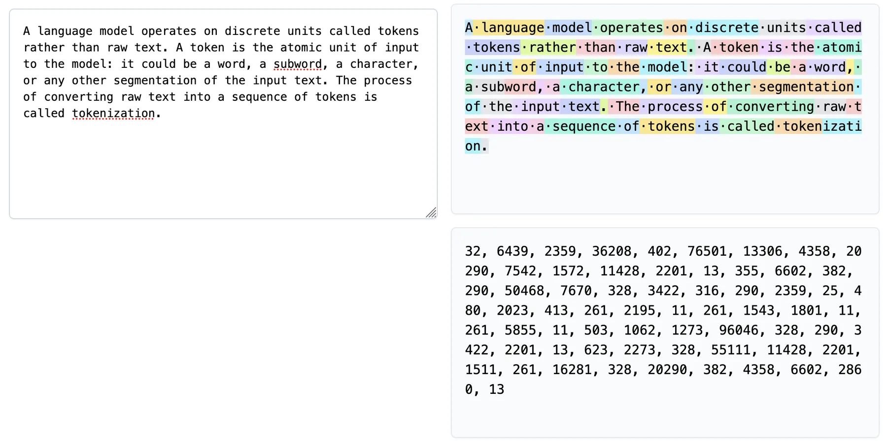
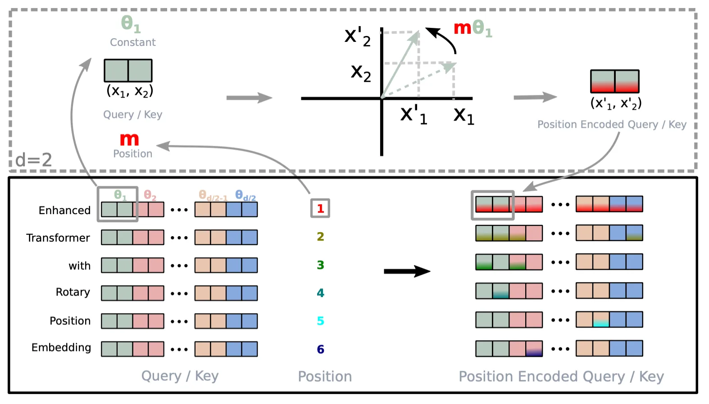
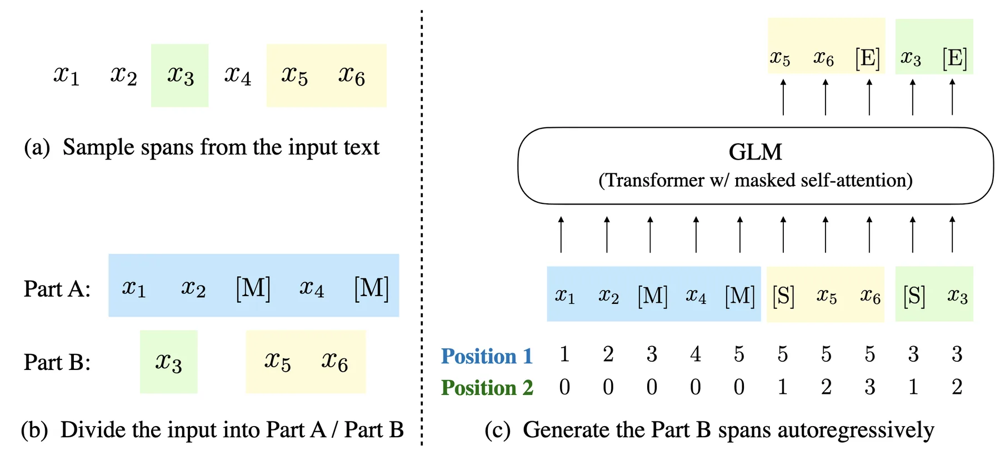
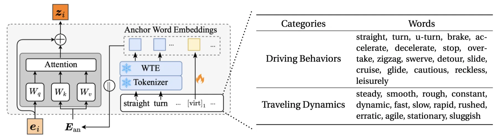
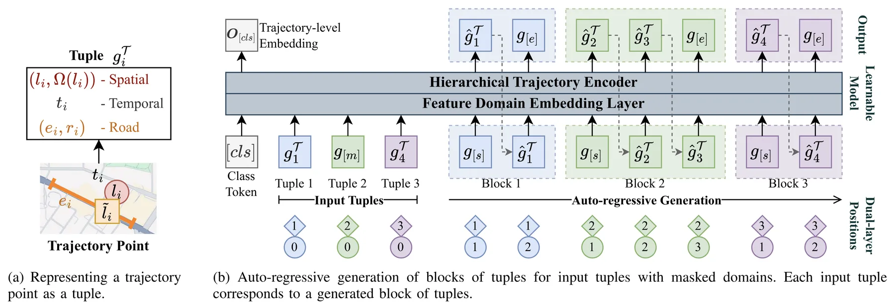

+++
title = "On the Horizon of Large Trajectory Models"
date = 2026-02-05
description = ""
weight = 8

[extra]
chapter = "Chapter 8"
+++

Large language models (LLMs) are the backbone of the latest AI hype and are taking all the attention in the natural language processing (NLP) domain, or even most of the attention in the broad AI and ML community.

As we noticed in [end-to-end learning](../end-to-end) and [self-supervised learning](../self-supervised) for trajectories, trajectories share technical and semantic similarity with sentences in NLP, and that enables us to adapt many NLP techniques to trajectory learning.

The same story applies to adapting techniques introduced in LLMs to build so-called _large trajectory models_.
In this post, we will discuss the fundamentals of these techniques, what to look for when adapting them to trajectory learning, and the necessity and future directions for large trajectory models.

{{ toc() }}

## Foundation of Language Models

Before the rise of LLMs, there are already a well-established suite of techniques for building language models, and these foundational techniques mostly get adapted or improved in modern LLMs.

### Tokens and Tokenization

A language model operates on discrete units called tokens rather than raw text. A token is the atomic unit of input to the model: it could be a word, a subword, a character, or any other segmentation of the input text. The process of converting raw text into a sequence of tokens is called tokenization.

At inference time, the tokenizer maps input text to a sequence of token IDs, each corresponding to an entry in the model's vocabulary $\mathcal{V}$. For a text input, the tokenizer produces:

$$\text{Tokenize}(\text{"the quick brown fox"}) \rightarrow [t_1, t_2, t_3, t_4]$$

where each $t_i \in \{1, 2, \ldots, |\mathcal{V}|\}$ is an index into the vocabulary. The model processes these token IDs by first looking up their corresponding embedding vectors from an embedding matrix $\mathbf{E} \in \mathbb{R}^{|\mathcal{V}| \times d}$, where $d$ is the embedding dimension.

An example of tokenized sentences. Source: [Tiktokenizer](https://tiktokenizer.vercel.app/)

Different tokenization strategies exist, each with trade-offs between vocabulary size and sequence length. Word-level tokenization is intuitive but requires a very large vocabulary. Character-level tokenization has a small vocabulary but produces very long sequences. Modern LLMs use subword tokenization, which breaks words into meaningful subunits that balance vocabulary size and sequence length. For a detailed treatment of tokenization, see [Karpathy's tutorial](https://www.youtube.com/watch?v=zduSFxRajkE).

### The Transformer Architecture

The Transformer is the architectural backbone of most modern language models. We have encountered Transformers in previous chapters when discussing contextual embeddings and sequence modeling. Here we recap the key components with emphasis on aspects relevant to LLMs.

A Transformer processes a sequence of token embeddings $\mathbf{X} = (\mathbf{x}_1, \mathbf{x}_2, \ldots, \mathbf{x}_n)$ where $\mathbf{x}_i \in \mathbb{R}^d$. The core mechanism is self-attention, which computes attention weights between all pairs of positions based on their query and key vectors, then aggregates value vectors accordingly:

$$\text{Attention}(\mathbf{Q}, \mathbf{K}, \mathbf{V}) = \text{Softmax}\left(\frac{\mathbf{Q}\mathbf{K}^\top}{\sqrt{d_k}}\right)\mathbf{V}$$

where $\mathbf{Q}$, $\mathbf{K}$, $\mathbf{V}$ are linear projections of the input embeddings.

Self-attention is permutation-equivariant: it treats the input as a set rather than a sequence. To distinguish token positions, positional information must be explicitly provided. The original Transformer adds fixed sinusoidal positional encodings to the input embeddings:

$$PE_{(pos,2i)} = \sin(pos/10000^{2i/d}), \quad PE_{(pos,2i+1)} = \cos(pos/10000^{2i/d})$$

Different dimensions encode position at different frequencies, allowing the model to capture both fine-grained and coarse-grained positional differences. However, since these encodings are added directly to token embeddings, absolute positions become hardcoded into each token's representation. This causes problems when the model encounters sequences longer than those seen during training, as it must extrapolate to position indices it has never observed.

Modern LLMs predominantly use _Rotary Position Embedding_ (RoPE), which encodes purely relative positional information (see [this post](@/ml-tech/rotary-pe/index.md) for a detailed treatment of RoPE and its extensions). Instead of adding position encodings to embeddings, RoPE rotates the query and key vectors by an angle proportional to their position:

$$f(\mathbf{x}_m, m) = \mathbf{R}_m \mathbf{W} \mathbf{x}_m$$

where $\mathbf{R}_m$ is a block-diagonal rotation matrix with rotation angles determined by position $m$ and dimension-specific frequencies.
The dot product of two rotated vectors depends only on the difference of their rotation angles, which means the attention weight between positions $m$ and $n$ depends only on their relative distance $m - n$, not their absolute positions.

RoPE encodes positional information by rotating input vectors.

This relative formulation improves generalization to longer sequences. A model trained on sequences up to length $L$ has learned to interpret relative distances up to $L$. When processing longer sequences at inference time, it can still reason about token pairs whose relative distance falls within the trained range, even if their absolute positions exceed $L$. Various techniques like positional interpolation and YaRN further extend this capability by carefully scaling the rotation frequencies.

### Language Modeling Objectives

A language model learns a probability distribution over sequences of tokens. The way this distribution is factorized and trained differs between model types.

_Autoregressive language models_ factorize the joint probability as a product of conditional probabilities, predicting each token given all previous tokens:

$$P(t_1, t_2, \ldots, t_n) = \prod_{i=1}^{n} P(t_i \mid t_1, t_2, \ldots, t_{i-1})$$

Training maximizes the log-likelihood of observed sequences. At each step, the model predicts a distribution over the vocabulary for the next token. This is the foundation of models like GPT.

_Masked language models_ take a different approach, as we saw with BERT in [self-supervised learning](../self-supervised). Instead of predicting the next token, the model predicts randomly masked tokens given their bidirectional context. This allows the model to use information from both past and future positions, but the training objective does not directly model the joint probability of sequences.

The choice of objective affects what the model learns. Autoregressive models are naturally suited for generation tasks, as they can sample tokens one by one by conditioning on previously generated tokens. Masked language models are better suited for tasks that require understanding the full context, such as classification and extraction.
Modern LLMs predominantly use the autoregressive objective, since their task is centered around generating text.

There are also hybrid approaches that combine both objectives. For example, GLM uses a _blank-infilling objective_: random spans of text are replaced with mask tokens, and the model must predict the content of each span. The surrounding context is encoded bidirectionally, but within each masked span, tokens are generated autoregressively.

Blank-infilling objective used by GLM.

> **References:**
> - Vaswani, Ashish, Noam Shazeer, Niki Parmar, et al. "Attention Is All You Need."
> - Su, Jianlin, Murtadha Ahmed, Yu Lu, Shengfeng Pan, Wen Bo, and Yunfeng Liu. "RoFormer: Enhanced Transformer with Rotary Position Embedding."
> - Du, Zhengxiao, Yujie Qian, Xiao Liu, et al. "GLM: General Language Model Pretraining with Autoregressive Blank Infilling."

## Developments of Large Language Models

Large language models are built on largely the same foundational techniques discussed above.
What distinguishes LLMs from earlier language models is a combination of scale, training strategies, and architectural refinements that together produce qualitatively different capabilities.

### Scale and Scaling Laws

The most obvious difference between LLMs and their predecessors is scale in both model parameters and training data.
Early language models like the original GPT had around 100 million parameters trained on several gigabytes of text.
Modern LLMs have hundreds of billions of parameters trained on trillions of tokens from diverse sources including web crawls, books, code repositories, curated datasets, ~and stolen assets~.

The relationship between scale and performance follows predictable patterns known as scaling laws. The loss $L$ of a language model decreases as a power law with respect to model size $N$, dataset size $D$, and compute budget $C$:

$$L(N) \propto N^{-\alpha_N}, \quad L(D) \propto D^{-\alpha_D}, \quad L(C) \propto C^{-\alpha_C}$$

where $\alpha_N$, $\alpha_D$, and $\alpha_C$ are empirically determined exponents. These relationships hold across several orders of magnitude, allowing practitioners to predict the performance of larger models before training them. The [Chinchilla scaling analysis](https://arxiv.org/abs/2203.15556) further showed that for a given compute budget, there is an optimal balance between model size and data size, and many early LLMs were undertrained relative to their size. For a comprehensive treatment of the scaling hypothesis, see [Gwern's essay](https://gwern.net/scaling-hypothesis).

### Training Strategies

Beyond scale, the training process itself has evolved. Modern LLM development typically proceeds in multiple stages.

The first stage is _pretraining_, where the model learns to predict the next token on a large corpus using the autoregressive objective. This produces a base model that has learned language patterns, factual knowledge, and reasoning capabilities, but does not follow instructions naturally.

The second stage is _supervised fine-tuning_ (SFT), where the model is trained on curated instruction-response pairs to follow user instructions and produce helpful responses. After SFT, the model can engage in dialogue, but its responses may not align well with human preferences.

The third stage involves _reinforcement learning from human feedback_ (RLHF) or related techniques. Human evaluators compare model outputs and indicate preferences, which are used to train a reward model. The language model is then fine-tuned using reinforcement learning to maximize the reward:


\mathcal{L}_{\text{RLHF}} = -\mathbb{E}_{x, y \sim \pi_\theta}[r_\phi(x, y)] + \beta \cdot D_{\text{KL}}[\pi_\theta \| \pi_{\text{ref}}]


where $\pi_\theta$ is the policy being trained, $r_\phi$ is the reward model, and $\pi_{\text{ref}}$ is a reference policy that prevents excessive deviation from the SFT model. Variants like Direct Preference Optimization (DPO) simplify this by directly optimizing on preference data without a separate reward model. For details on RLHF and its variants, see [the HuggingFace blog](https://huggingface.co/blog/rlhf).

### Architectural and Inference Techniques

While the core Transformer architecture remains largely unchanged, many techniques have been developed to improve its efficiency and capability.

_Mixture of Experts_ (MoE) is an architecture that scales model capacity without proportionally increasing compute. Instead of a single feedforward network in each Transformer layer, MoE uses multiple expert networks with a routing mechanism that selects a subset of experts for each token:

$$\text{MoE}(\mathbf{x}) = \sum_{i=1}^{E} g_i(\mathbf{x}) \cdot \text{Expert}_i(\mathbf{x})$$

where $g_i(\mathbf{x})$ is a gating function that produces sparse weights, typically activating only the top-$k$ experts. This allows models to have many more parameters while keeping inference cost manageable, since only a fraction of parameters are used for each token. For more details on MoE, see [the HuggingFace guide](https://huggingface.co/blog/moe).

Efficient inference is critical for deploying LLMs at scale.
Techniques span multiple levels: at the model level, methods like _quantization_ reduce numerical precision to shrink memory footprint, while attention variants such as _grouped query attention_ share key-value heads to reduce cache size; at the system level, optimizations include _KV-cache management_, _speculative decoding_, and _batching strategies_.
See [the NVIDIA blog on inference optimization](https://developer.nvidia.com/blog/mastering-llm-techniques-inference-optimization/), or [this survey paper](https://arxiv.org/abs/2404.14294) for more discussions around the topic.

[_Chain-of-thought_](https://arxiv.org/abs/2201.11903) (CoT) prompting is an inference-time technique that improves reasoning by having the model generate intermediate steps before producing a final answer. Rather than directly outputting a solution, the model is prompted to think step by step, decomposing complex problems and catching errors in intermediate reasoning.

## Building Large Trajectory Models

The idea of large trajectory models is to take inspiration from the latest techniques and architecture choices of LLMs to build large scale models for trajectory learning, or directly migrate a pre-trained LLM to enable its understanding of trajectory data.
As mentioned above trajectories and sentences in NLP have similarity, yet they are also different in many ways, thus adapting LLMs to trajectories requires some specific designs and considerations.

### Trajectory Tokenizer

When training a trajectory model from scratch, embedding trajectory points follows the same principles as in [self-supervised learning](../self-supervised). Technically there is not much limitation on the design of embedding layer for trajectory features.

If we want to adapt the pre-trained Transformer from an LLM, then we face a representation gap: the Transformer layers expect inputs in the word embedding space, but trajectory embeddings encode spatio-temporal patterns with no inherent relationship to linguistic semantics. One approach to bridge this gap is _reprogramming through cross-attention_.

The idea is to define a set of anchor words semantically related to movement patterns, such as "straight," "turn," "accelerate," "decelerate," "steady," and "stationary."
These patterns are properties of trajectory segments rather than individual points, so we first encode local context using convolutions or sliding windows over consecutive points.
Let \mathbf{e}_i denote the resulting embedding for position i, which captures the movement pattern around that position. Let \mathbf{E}_{\text{an}} \in \mathbb{R}^{|\mathcal{M}| \times d} be the matrix of frozen anchor word embeddings from the LLM. We project the trajectory embedding onto this semantic space:


\tilde{\mathbf{z}}_i = \text{Attention}(\mathbf{e}_i, \mathbf{E}_{\text{an}}, \mathbf{E}_{\text{an}})


where \mathbf{e}_i is the query and \mathbf{E}_{\text{an}} provides both keys and values. The output is a weighted combination of anchor word embeddings, with weights reflecting which movement patterns the segment exhibits.

The reprogramming module and anchor words in TrajCogn.

An alternative approach is to directly serialize trajectory features into text and feed them through the LLM's native tokenizer. For features that are already textual, such as POI names or addresses, this is straightforward. For continuous features like coordinates, one can simply convert numbers to their string representations. This technically works, but LLMs are not well-known for their ability to reason about raw numbers, let alone spatial relationships encoded in coordinate pairs. A trajectory represented as a sequence of "(lat, lng)" strings may be parseable by the model, but whether it can extract meaningful spatial patterns from such input is questionable.

To address this limitation, one can transform trajectory data into modalities that LLMs handle more naturally. For example, visualizing a trajectory as an image and feeding it to a multi-modal LLM that accepts visual input allows the model to perceive spatial structure directly. The rendered trajectory on a map background provides geographic context that would be difficult to convey through coordinate strings alone.

Mixture of textual and visual representations of trajectory features in Traj-MLLM.

### Efficient Fine-tuning on Trajectories

When adapting pre-trained Transformers from LLMs to trajectory learning, we face a practical dilemma. On one hand, the pre-trained parameters encode valuable linguistic and reasoning capabilities that we want to preserve. On the other hand, the model needs to learn trajectory-specific patterns that differ substantially from natural language. Full fine-tuning is problematic for several reasons: it risks catastrophic forgetting of pre-trained knowledge, requires substantial compute to update billions of parameters, and trajectory datasets are typically orders of magnitude smaller than the corpora used for LLM pre-training, making overfitting a concern.

These considerations motivate efficient fine-tuning techniques that update only a small subset of parameters while keeping most of the pre-trained model frozen.

One straightforward approach is selective layer fine-tuning, where certain layers or components of the Transformer are frozen while others remain trainable. For instance, one might freeze the self-attention layers and only fine-tune the feed-forward networks, or vice versa.

A more principled approach is _Low-Rank Adaptation_ (LoRA), which adds trainable low-rank decomposition matrices to the frozen pre-trained weights. For a pre-trained weight matrix $\mathbf{W}_0 \in \mathbb{R}^{d \times k}$, instead of learning a full update $\Delta\mathbf{W}$, LoRA parameterizes it as:

$$\mathbf{W} = \mathbf{W}_0 + \Delta\mathbf{W} = \mathbf{W}_0 + \mathbf{B}\mathbf{A}$$

where $\mathbf{B} \in \mathbb{R}^{d \times r}$ and $\mathbf{A} \in \mathbb{R}^{r \times k}$ with rank $r \ll \min(d, k)$. During training, $\mathbf{W}_0$ is frozen and only $\mathbf{A}$ and $\mathbf{B}$ are updated. This reduces the number of trainable parameters dramatically while still allowing expressive adaptations.

LoRA is typically applied to the query and value projection matrices in self-attention, though it can be extended to other weight matrices. The rank $r$ controls the trade-off between adaptation capacity and parameter efficiency. See [the Hugging Face LLM course](https://huggingface.co/learn/llm-course/en/chapter11/4) for a comprehensive treatment of LoRA and its variants.

### LLM-style Generation of Trajectories

LLMs can replace most conventional language models built for specific tasks. The main reason is that their universal understanding of natural language means one can frame a classic language modeling task, like sentiment analysis, as a natural language question and set a LLM to answer it (e.g., using "what is the sentiment in the above sentence?" as the prompt). In other words, many tasks can be framed into conditioned text generation, and a LLM that can perform text generation automatically can perform these tasks.

Similarly, many trajectory tasks can be unified under a single paradigm: conditioned generation of missing trajectory features.
To formalize this, we can organize trajectory features into distinct feature domains. A natural division for vehicle trajectories is: a spatial domain containing GPS coordinates and nearby road segment candidates, a temporal domain containing timestamps, and a road domain containing the matched road segment and the fraction of that segment traveled. Each point in a trajectory is then represented as a tuple containing one element from each domain:

$$g_i = ((l_i, \Omega(l_i)), t_i, (e_i, r_i))$$

where $l_i$ is the coordinate, $\Omega(l_i)$ is the set of candidate road segments near $l_i$, $t_i$ is the timestamp, $e_i$ is the matched road segment, and $r_i$ is the travel fraction along that segment.

The generation framework operates by masking unknown domains with a special mask token $[m]$ and training the model to predict them. For a tuple with a masked temporal domain, such as $((l_i, \Omega(l_i)), [m], (e_i, r_i))$, the model generates the missing timestamp. For a completely masked tuple $g_{[m]} = ([m], [m], [m])$, the model generates all features for that position. Crucially, similar to how GLM's blank token can represent a span of unknown length, a single $g_{[m]}$ can represent a variable-length sub-trajectory. This is useful when the number of missing points is not known in advance, such as recovering the path between two sparse observations or predicting future trajectory of unknown length.

Generation proceeds autoregressively, similar to how LLMs generate text token by token. Given an input sequence containing masked elements, the model appends a start token, then iteratively generates tuples until it produces an end token. Each generated tuple is appended to the context for generating the next one:


\text{input}: g_1, g_{[m]}, g_4 \quad \rightarrow \quad \text{output}: \hat{g}_1, [e], \hat{g}_2, \hat{g}_3, [e], \hat{g}_4, [e]


Here $g_{[m]}$ represents missing points between $g_1$ and $g_4$, and the model generates a variable-length sequence $\hat{g}_2, \hat{g}_3$ to fill the gap. Each masked input tuple corresponds to a generated block terminated by the end token $[e]$.

Implementation of the above generation paradigm in UVTM.

Under this formulation, we can frame different tasks with different masking patterns. For origin-destination travel time estimation, the input is $(l_o, t_o, [m]), (l_d, [m], [m])$, where only the origin coordinate, departure time, and destination coordinate are known, and the model generates the arrival time as part of the destination tuple. For trajectory recovery, known sparse points have complete tuples while gaps between them are marked with $g_{[m]}$, and the model generates the intermediate points. For trajectory prediction, historical points are complete and a single $g_{[m]}$ at the end signals that future points should be generated.

> **References:**
> - Zhou, Zeyu, Yan Lin, Haomin Wen, et al. "TrajCogn: Leveraging LLMs for Cognizing Movement Patterns and Travel Purposes from Trajectories."
> - Liu, Shuo, Di Yao, Yan Lin, Gao Cong, and Jingping Bi. "Traj-MLLM: Can Multimodal Large Language Models Reform Trajectory Data Mining?"
> - Lin, Yan, Jilin Hu, Shengnan Guo, et al. "UVTM: Universal Vehicle Trajectory Modeling With ST Feature Domain Generation."

## How Necessary are Large Trajectory Models?

The techniques discussed above represent a growing research direction, but whether large trajectory models are truly necessary remains an open question.

On one hand, pre-trained LLMs can reduce data requirements through transfer learning, since they start from a capable initialization rather than random weights.
LLMs also bring multimodal understanding that traditional trajectory models lack: a GPS point might correspond to a restaurant or hospital with textual descriptions, reviews, and metadata that coordinate-based models simply discard. This could enable deeper reasoning about trip purposes and user preferences.
There is also the possibility of improved cross-domain generalization, as pre-trained models may have learned general knowledge about urban mobility and human activities.

On the other hand, there are fundamental reasons to question whether trajectory data requires LLM-scale models. Language is extraordinarily complex, with syntax, semantics, and world knowledge interweaving in ways that justify massive parameter counts. Trajectories are sequences of coordinates governed by relatively simple physical and geographical constraints that can often be encoded explicitly without requiring billions of parameters to learn implicitly.
There are empirical evidence that supports this concern: existing large trajectory models often have 100 times more parameters than conventional models, yet typically achieve only around 10% performance improvement.

Also, natural language shares a universal semantic structure regardless of source, era, or cultural context, which is why training on massive diverse corpora produces emergent capabilities. Trajectories lack this universality. Taxi patterns in Shanghai have limited relevance to ship routes in the Pacific. While trajectories do follow universal physical laws, those laws are simple enough to be expressed in closed-form equations like $d = v \cdot t$.

Finally, LLMs are not optimized for numerical reasoning. Their tokenization and training objectives are designed for discrete linguistic tokens, not continuous coordinates. Forcing trajectory data through a representation pipeline designed for language may introduce unnecessary friction.

Given these considerations, one might wonder whether the current pursuit of large trajectory models is driven more by academic publication trends than by practical utility. The field may benefit from techniques developed for LLMs, like attention mechanisms and pre-training objectives, without necessarily requiring LLM-scale models. The structured nature of spatiotemporal data might be better served by purpose-built architectures, augmented selectively by ideas from the language modeling literature.

One direction that could justify large-scale trajectory models is enabling multimodal output capabilities that conventional models cannot provide, which we discuss further in the next section.

> **References:**
> - Tan, Mingtian, Mike A. Merrill, Vinayak Gupta, Tim Althoff, and Thomas Hartvigsen. "Are Language Models Actually Useful for Time Series Forecasting?"

## Future Directions

Given these limitations, the question becomes: what would make large trajectory models genuinely worthwhile? The answer likely lies not in achieving marginal improvements on existing benchmarks, but in enabling capabilities that conventional models cannot provide. We present two directions below.

The first is leveraging natural language as an interface for trajectory analysis. Traditional trajectory mining tools require users to write code or use specialized query languages, limiting accessibility to those with technical expertise. LLMs could democratize trajectory analysis by accepting natural language queries like "show me unusual commute patterns last month" and translating them into appropriate data operations. Beyond querying, language interfaces enable explanation: a model could articulate why it flagged a trajectory as anomalous or what patterns it detected in a dataset. This is where the language capabilities of LLMs provide clear value that coordinate-based models cannot replicate. The challenge is grounding language understanding in trajectory semantics, ensuring that natural language queries map correctly to spatiotemporal operations.

The second direction extends beyond analysis toward autonomous decision-making. LLMs have evolved from text generators to agents that can use tools, access external information, and execute multi-step plans. Trajectory models could follow a similar path: systems that not only answer "what will happen" but also "what should happen." Such a system might query real-time traffic APIs, check weather forecasts, and consult map services to generate route recommendations under constraints. It would validate its outputs against physical reality, detecting when a predicted path passes through buildings or violates traffic rules, and regenerate accordingly. This represents a shift from trajectory understanding to trajectory reasoning, and it requires integrating large models with external tools and knowledge sources in ways that current architectures do not support.
