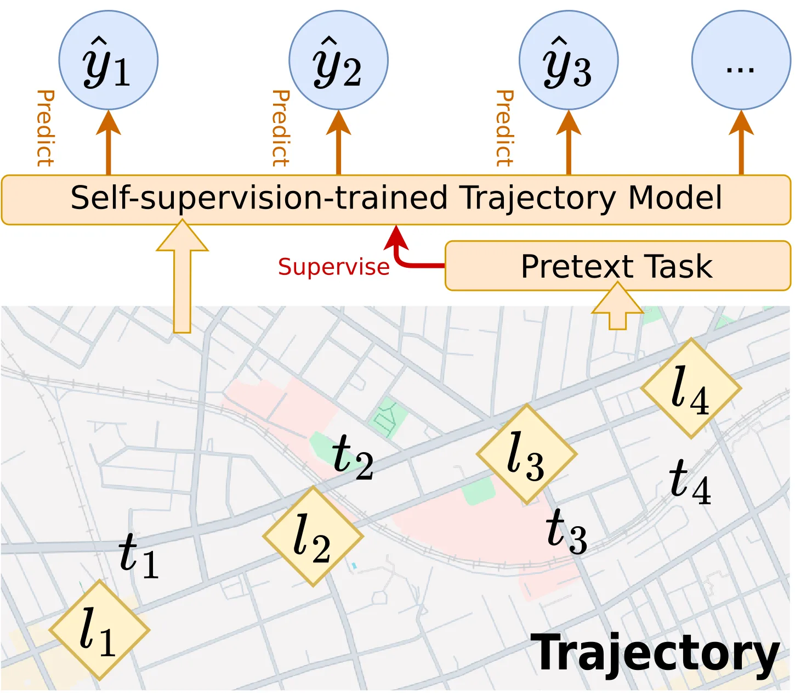
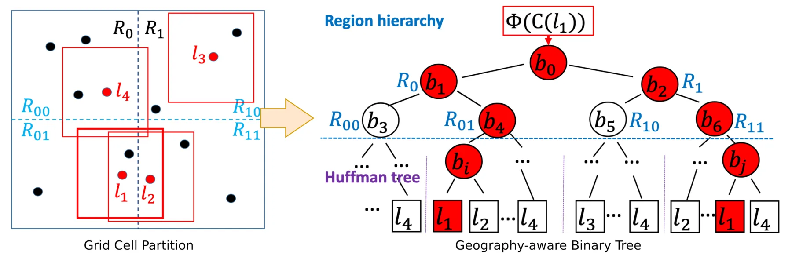
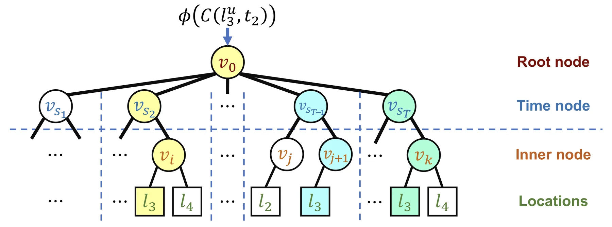
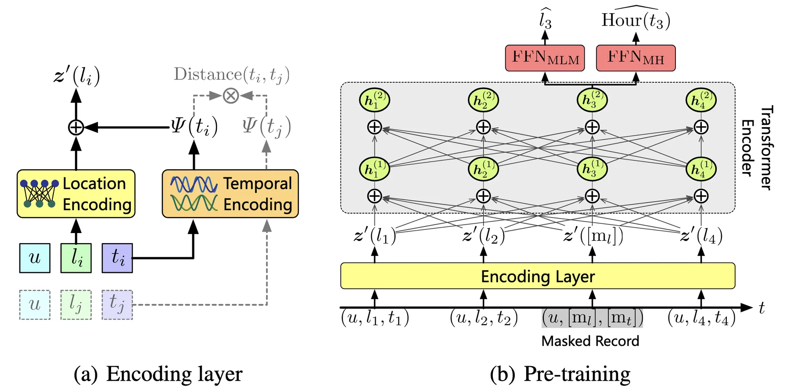
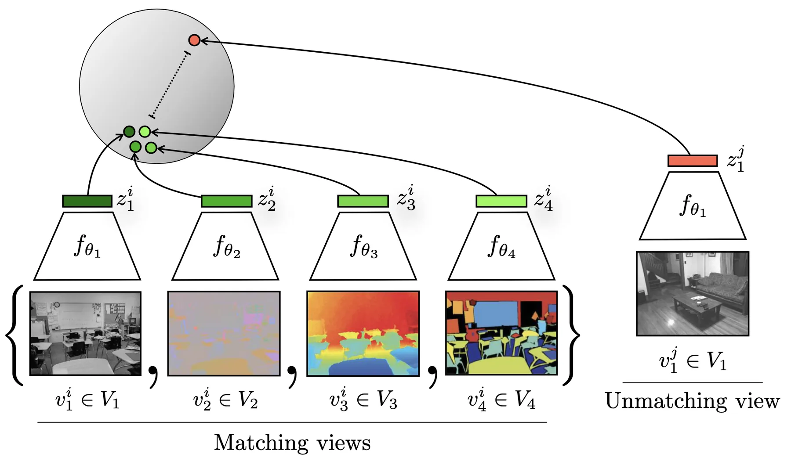

+++
title = "Self-supervised Learning of Trajectories"
date = 2026-02-03
description = ""
+++

Self-supervised learning means training a model with unlabeled data, using supervisory signals extracted from the data itself. It usually does not set the model to perform a certain task, but aims to learn task-agnostic information in the data.
Compared to [end-to-end learning](@/dl4traj/end-to-end/index.md), self-supervised learning does not rely on labeled data to train the model; in other words, it can be helpful when the availability of labeled data is limited.
This is also very relevant in the context of trajectory learning, since the availability of unlabeled trajectory datasets is usually much higher than that of labeled ones.

Self-supervised learning is also widely used to pre-train deep learning models. Put into the perspective of trajectories, self-supervised learning can help models get a general understanding of trajectory sequences or components in trajectories; the pre-trained models can later be fine-tuned on specific tasks, or be used directly for unsupervised tasks like clustering.

> Illustration of self-supervised learning of spatiotemporal trajectories.

Most widely-adopted self-supervised learning frameworks for trajectories originate from the natural language processing (NLP), graph learning, and computer vision (CV) domains.
In this post we categorize self-supervised learning methods for trajectories based on the framework they adhere to: static word embedding, graph node embedding, contextual word embedding, auto-encoding, and contrastive learning.
For each framework, we will briefly go through the original formulation of the framework, how to adapt them for trajectories, and applications of the trained representation or model.

{{ toc() }}

## Static Word Embedding

Static word embedding is the first mainstream branch of self-supervised learning techniques in the NLP domain.
It learns an embedding vector for each word in the given corpus, and the training process only relies on the sentences in the corpus. Each embedding vector extracts the semantic meaning of a word by modeling the usual context (nearby neighbor words) of that word in the corpus.

Trajectories share some similarities with sentences: they are both sequences, and contextual information of each location can be extracted from trajectories in a similar manner to static word embeddings.
Thus, we can adapt static word embedding methods to perform self-supervised learning of trajectories.

### Foundational Framework: Word2vec

Word2vec is a family of models that learn word embeddings by predicting words from their context or vice versa.
Given a corpus of sentences, word2vec learns a $d$-dimensional embedding vector $\mathbf{e}_w \in \mathbb{R}^d$ for each word $w$ in the vocabulary.
Words appearing in similar contexts should have similar meanings, and therefore similar embeddings.

Word2vec has two main architectures. In the _Continuous Bag of Words_ (CBOW) model, the objective is to predict a target word given its surrounding context words. Let $C(w) = \{w_{-k}, \ldots, w_{-1}, w_{+1}, \ldots, w_{+k}\}$ denote the context of word $w$ within a window of size $k$. The CBOW model maximizes:


P(w \mid C(w)) = \frac{\exp(\mathbf{e}_w^\top \bar{\mathbf{e}}_{C(w)})}{\sum_{w' \in V} \exp(\mathbf{e}_{w'}^\top \bar{\mathbf{e}}_{C(w)})}


where $\bar{\mathbf{e}}_{C(w)}$ is the average of context word embeddings and $V$ is the vocabulary.

In the _Skip-gram_ model, the objective is reversed: predict context words given the target word. The model maximizes $\prod_{c \in C(w)} P(c \mid w)$ where each conditional probability is computed similarly to CBOW.

The softmax denominator requires summing over the entire vocabulary, which is computationally expensive. Two approximation techniques are commonly used. _Negative sampling_ replaces the full softmax with a binary classification task that distinguishes true context pairs from randomly sampled negative pairs. _Hierarchical softmax_ organizes the vocabulary as a binary tree (typically a Huffman tree based on word frequency) and decomposes the probability into a path of binary decisions from root to leaf.

### Adapting to Trajectories: Locations as Words

The analogy between sentences and trajectories is straightforward: sentences are sequences of words, and trajectories are sequences of locations. Given a set of trajectories, each location $l$ is mapped to an embedding $\mathbf{e}_l \in \mathbb{R}^d$ that captures its typical context within trajectories.

For a trajectory $\mathcal{T} = \langle (l_1, t_1), (l_2, t_2), \ldots, (l_n, t_n) \rangle$, the context of location $l_i$ consists of nearby locations in the sequence: $C(l_i) = \{l_{i-k}, \ldots, l_{i-1}, l_{i+1}, \ldots, l_{i+k}\}$.
The CBOW objective predicts $l_i$ from $C(l_i)$, while Skip-gram predicts each context location from $l_i$.

The resulting location embeddings encode co-visitation patterns: locations frequently visited together or in sequence will have similar embeddings. This captures functional similarity (e.g., different coffee shops may have similar embeddings because they appear in similar trajectory contexts) and sequential relationships (e.g., a subway station and nearby office buildings may have similar embeddings due to commute patterns).

However, standard word2vec treats the input as purely sequential data and ignores the spatiotemporal nature of trajectories. 
Trajectories contain two important properties: spatial proximity (nearby locations are related even if they never co-occur in the same trajectory) and temporal periodicity (location visits follow daily and weekly patterns). Several methods extend the word2vec framework to incorporate these properties.

_POI2Vec_ incorporates spatial proximity by adding geography-awareness to the hierarchical softmax structure.
It constructs the Huffman tree by recursively partitioning the geographic space into square grid cells. Within each leaf cell, locations are organized into a Huffman subtree based on their visit frequencies. This way, the upper levels of the tree encode spatial hierarchy, and locations with spatial proximity will have similar embeddings.

> Construction of the geography-aware binary tree in POI2Vec.

_TALE_ incorporates temporal periodicity with a time-aware hierarchical softmax structure. Many locations exhibit strong temporal patterns: office buildings are visited during work hours, restaurants peak at meal times, and entertainment venues are active at night. TALE captures these patterns by replacing the standard Huffman tree used in hierarchical softmax with a temporal tree.
The temporal tree has a root node at the top level, followed by time nodes corresponding to equal-length time slices of a day. Below each time node, a Huffman subtree organizes the locations that are visited during that time slice, based on their visit frequencies within that slice.

> The temporal tree in TALE.

Predicting a visit $(l, t)$ requires traversing a path through this tree, which decomposes into two stages:

$$P(l, t \mid C(l, t)) = P(s_t \mid C(l, t)) \times P(l \mid C(l, t), s_t)$$

where $s_t$ is the time slice containing timestamp $t$, and $C(l, t)$ is the trajectory context. The first term predicts which time slice the visit belongs to, computed by a multi-class classifier at the root. The second term predicts the specific location within that time slice's subtree using standard hierarchical softmax.
Locations with similar temporal visitation patterns will be closer in the embedding space.

### Applications: Learning POI Functionalities

The location embeddings learned through these methods encode functional roles based on visitation patterns. When locations are Points of Interest (POIs), the embeddings can support tasks such as POI category classification and next-visit prediction, since POIs of the same category tend to have similar visitation patterns and thus similar embeddings. The same framework applies when locations are Areas of Interest (AOIs), where embeddings of urban zones or grid cells can be used for visiting flow prediction between areas.

> **References:**
> - Mikolov, Tomas, Kai Chen, Greg Corrado, and Jeffrey Dean. "Efficient Estimation of Word Representations in Vector Space."
> - Feng, Shanshan, Gao Cong, Bo An, and Yeow Meng Chee. "POI2Vec: Geographical Latent Representation for Predicting Future Visitors."
> - Wan, Huaiyu, Yan Lin, Shengnan Guo, and Youfang Lin. "Pre-Training Time-Aware Location Embeddings from Spatial-Temporal Trajectories."

## Graph Node Embedding

Many classic graph node embedding methods are essentially extensions of static word embedding methods on graphs. They aim to learn an embedding vector for each node in a graph that encodes the graph's topology information.
Since graphs are not sequences, such methods usually start with sampling sequences from a graph (e.g., through random walks) and then apply static word embedding methods to the sequences.

Trajectories can also be constructed into graphs to represent spatiotemporal information, for example, transition flow graphs between areas. Thus, it is possible to adapt graph node embedding methods to trajectory-derived graphs.

### Foundational Framework: DeepWalk and node2vec

_DeepWalk_ learns node embeddings by treating a graph as a corpus of sentences. Given a graph $G = (V, E)$, the algorithm generates sequences of nodes by performing random walks starting from each node. A random walk of length $L$ starting from node $v_0$ produces a sequence $\langle v_0, v_1, \ldots, v_L \rangle$, where each subsequent node $v_{i+1}$ is sampled uniformly from the neighbors of $v_i$. These random walk sequences serve as the "sentences" for training a Skip-gram model.
The objective is to maximize the log probability of observing context nodes within a window around each node in the sequence:

$$
\max_{\mathbf{e}} \sum_{v \in V} \sum_{c \in C(v)} \log P(c \mid v)
$$

where $C(v)$ is the set of context nodes appearing near $v$ in random walks, and $\mathbf{e}_v \in \mathbb{R}^d$ is the embedding for node $v$.

_node2vec_ extends DeepWalk with biased random walks that interpolate between local and global graph exploration. Two parameters control the walk behavior: the return parameter $p$ governs the likelihood of immediately revisiting the previous node, while the in-out parameter $q$ controls whether the walk stays local (high $q$) or explores outward (low $q$). This flexibility allows node2vec to capture different structural properties depending on the application.

### Adapting to Trajectories: Graphs from Trajectory Data

To apply graph node embedding methods, we first construct a graph from trajectory data. The most common approach is to build a transition graph $G = (V, E)$, where nodes $V$ represent locations and edges $E$ represent observed transitions between locations.

Given a set of trajectories $\{\mathcal{T}_1, \mathcal{T}_2, \ldots, \mathcal{T}_N\}$ over a location set $\mathcal{L}$, we create a directed edge $(l_i, l_j)$ whenever a trajectory contains consecutive visits to $l_i$ followed by $l_j$. Edge weights can be set to the transition frequency, representing how often people move from one location to another. This transition graph encodes aggregate mobility patterns across all trajectories.

Applying DeepWalk or node2vec to this transition graph produces location embeddings that capture connectivity and flow patterns. Locations with similar roles in the mobility network will have similar embeddings. For example, two subway stations in different parts of a city may have similar embeddings if they serve as transfer hubs connecting multiple lines.

One limitation compared to the static word embedding approach is that the graph construction aggregates all trajectories, losing individual trajectory structure and temporal ordering beyond immediate transitions. However, this aggregation can also be viewed as a form of noise reduction, where the graph captures robust mobility patterns rather than individual trips.
Additionally, in scenarios where only aggregate transition data is available (e.g., origin-destination flow matrices) rather than individual trajectories, the graph-based approach remains applicable while static word embedding methods cannot be used.

### Applications: Learning Road Segment Roles

Graph node embedding methods are particularly suited for learning representations of road segments and AOIs. For road networks, each segment serves as a node and the graph captures connectivity, role in the road network, and traffic flow patterns; the learned segment embeddings can then be used in downstream tasks such as travel time estimation or traffic flow prediction. For AOIs, the transition graph between urban zones encodes inter-region mobility patterns, and the resulting embeddings can support tasks like land use classification or origin-destination flow prediction.

> **References:**
> - Perozzi, Bryan, Rami Al-Rfou, and Steven Skiena. "DeepWalk: Online Learning of Social Representations."
> - Grover, Aditya, and Jure Leskovec. "Node2vec: Scalable Feature Learning for Networks."

## Contextual Word Embedding

Recall that static word embedding methods learn one embedding vector for each unique word in the corpus. The limitation of this is that words can have vastly different meanings depending on the context (sentence the word is in), and static word embedding methods are essentially turning polysemous words into one averaged representation.
Contextual word embedding methods aim to overcome this limitation by incorporating the specific context a word is in when computing the word's embedding vector.

It is a similar story for trajectories: locations can have multiple functionalities, depending on the specific context (trajectory the location is in), and it would be beneficial to adapt contextual word embedding methods to learn location embeddings that more accurately reflect the specific functionalities.

### Foundational Framework: BERT and ELMo

_ELMo_ was one of the first methods to produce context-dependent word representations. Given a sentence, ELMo processes it with a multi-layer bidirectional LSTM: one LSTM reads the sentence left-to-right, another reads it right-to-left. For each word position, the hidden states from both directions and all layers are combined into a single representation. Crucially, this representation depends on the entire sentence, so the same word receives different embeddings in different contexts.

_BERT_ takes a different approach using the Transformer architecture. Instead of recurrent processing, BERT uses self-attention to allow each position to attend to all other positions simultaneously. This enables richer bidirectional context modeling compared to the concatenated unidirectional LSTMs in ELMo.

BERT is trained with a masked language model (MLM) objective. During training, a random subset of input tokens (typically 15%) are replaced with a special $[\text{MASK}]$ token, and the model learns to predict the original tokens from their surrounding context. For a masked position $i$ in a sequence, the model computes:

$$
P(w_i \mid w_1, \ldots, w_{i-1}, [\text{MASK}], w_{i+1}, \ldots, w_n)
$$

where the prediction is based on the bidirectional context encoded by the Transformer layers. This pre-training objective forces the model to learn rich contextual representations that capture how words function differently depending on their surroundings.

### Adapting to Trajectories: Neighbor Locations as Context

The direct adaptation of BERT to trajectories is straightforward: treat locations as tokens and trajectories as sentences. A bidirectional Transformer encoder processes the trajectory sequence, and for each location $l_i$ in the trajectory, the encoder outputs a contextual embedding $\mathbf{z}(l_i)$ that depends on the entire trajectory. The MLM objective randomly masks a portion of locations with a special token and trains the model to predict the masked locations from context.

_CTLE_ extends this basic adaptation with two key designs for incorporating temporal information. The first is a learnable time encoding. Before feeding into the Transformer, each trajectory point $(l_i, t_i)$ is represented as:

$$
\mathbf{z}'(l_i) = \Omega(l_i) + \Psi(t_i)
$$

where $\Omega(l_i)$ is a learned location embedding and $\Psi(t_i)$ is the time encoding. Unlike the fixed positional encodings in standard Transformers, CTLE uses learnable frequency parameters $\{\omega_1, \omega_2, \ldots, \omega_d\}$:

$$
\Psi(t) = [\cos(\omega_1 t), \sin(\omega_1 t), \ldots, \cos(\omega_d t), \sin(\omega_d t)]
$$

The learnable frequencies allow the model to adaptively capture temporal patterns in the data, such as visit periodicity (time intervals between visits to the same location) and dwell time (duration between consecutive visits).

The second design is an additional self-supervised objective called masked hour (MH) prediction: for each masked position, the model also predicts the hour of day when the visit occurred. This auxiliary objective shares similar motivation with TALE, that different location types have distinct temporal visit patterns. By predicting visit hours, the model learns to associate locations with their temporal characteristics.

> The model architecture of CTLE.

### Applications: Capturing Location Polysemy

Contextual location embeddings are particularly useful when downstream tasks require distinguishing between different functional roles of the same location.
For next location prediction, context-aware representations can outperform static embeddings by leveraging the surrounding trajectory to infer visit purpose.
The contextual embeddings can also serve as input features for trajectory-level tasks, where the entire trajectory representation is obtained by pooling or aggregating the contextual embeddings of individual locations.

However, the effectiveness of contextual modeling depends on data density.
Rich context from dense trajectory data (such as mobile signaling data) enables more effective contextual modeling.
Sparse data (such as check-in data) may not provide sufficient context for the approach to show clear advantages over static methods.

> **References:**
> - Peters, Matthew E., Mark Neumann, Mohit Iyyer, et al. "Deep Contextualized Word Representations."
> - Devlin, Jacob, Ming-Wei Chang, Kenton Lee, and Kristina Toutanova. "BERT: Pre-Training of Deep Bidirectional Transformers for Language Understanding."
> - Lin, Yan, Huaiyu Wan, Shengnan Guo, and Youfang Lin. "Pre-Training Context and Time Aware Location Embeddings from Spatial-Temporal Trajectories for User Next Location Prediction."

## Auto-encoding

Auto-encoding is a classic framework for learning compressed representations of data. Unlike the previous methods which design specific prediction objectives (predicting context words, masked tokens, etc.), auto-encoding uses a simpler objective: reconstruct the input data from a compressed representation.

This makes it straightforward to apply to trajectories without requiring careful design of the supervisory signal.
Auto-encoding also provides a natural way to obtain fixed-size trajectory embeddings regardless of trajectory length and without any labeled data. This enables tasks that require comparing trajectories of different lengths, such as similarity computation and clustering.

### Foundational Framework: Auto-encoder

An auto-encoder consists of two components: an encoder that maps the input to a lower-dimensional latent representation, and a decoder that reconstructs the input from this representation.
Given an input $\mathbf{x}$, the encoder produces a latent vector $\mathbf{z} = f_{\text{enc}}(\mathbf{x})$, and the decoder produces a reconstruction $\hat{\mathbf{x}} = f_{\text{dec}}(\mathbf{z})$. The model is trained to minimize the reconstruction loss:

$$
\mathcal{L}_{\text{AE}} = \| \mathbf{x} - \hat{\mathbf{x}} \|^2
$$

The latent vector $\mathbf{z}$ serves as a compressed representation of the input. If the latent dimension is smaller than the input dimension, the model is forced to learn a meaningful compression that preserves the essential information needed for reconstruction.

The _Variational Auto-encoder_ (VAE) extends this framework with a probabilistic formulation. Instead of mapping to a single latent vector, the encoder outputs parameters of a probability distribution, typically a Gaussian with mean $\boldsymbol{\mu}$ and variance $\boldsymbol{\sigma}^2$. The latent vector is then sampled from this distribution: $\mathbf{z} \sim \mathcal{N}(\boldsymbol{\mu}, \text{diag}(\boldsymbol{\sigma}^2))$. The VAE objective adds a regularization term that encourages the learned distribution to be close to a standard Gaussian prior.
This probabilistic structure enables generation of new samples by sampling from the prior and decoding.

The _Denoising Auto-encoder_ takes a different approach to learning robust representations. Instead of reconstructing a clean input from itself, the model receives a corrupted version of the input and learns to recover the original. Given an input $\mathbf{x}$ and a corruption process that produces $\tilde{\mathbf{x}}$, the model minimizes $\| \mathbf{x} - f_{\text{dec}}(f_{\text{enc}}(\tilde{\mathbf{x}})) \|^2$. Common corruption strategies include adding Gaussian noise, randomly zeroing out components, or dropping portions of the input. This forces the model to learn representations that capture the underlying structure of the data rather than memorizing specific inputs.

### Adapting to Trajectories: Seq2Seq Reconstruction

The main consideration when adapting auto-encoders to trajectories is handling variable-length sequences. The encoder must map a trajectory of arbitrary length to a fixed-size latent vector, and the decoder must generate a variable-length output from this vector.

A common choice is the sequence-to-sequence architecture with recurrent neural networks.
Given a trajectory $\mathcal{T} = \langle (l_1, t_1), (l_2, t_2), \ldots, (l_n, t_n) \rangle$, each point is first embedded into a vector representation. The encoder, typically an LSTM or GRU, processes the sequence and produces a final hidden state as the latent representation $\mathbf{z}$. The decoder, another recurrent network, takes $\mathbf{z}$ as its initial state and generates the reconstructed trajectory point by point.
Training minimizes the reconstruction loss between the original and reconstructed trajectories, computed as the sum of per-point losses, similar to [end-to-end training](@/dl4traj/end-to-end/index.md) for trajectory prediction or imputation.

The VAE formulation can also be adapted to trajectories. The encoder outputs distribution parameters $\boldsymbol{\mu}$ and $\boldsymbol{\sigma}^2$ instead of a single vector, and the latent representation is sampled during training.

The denoising approach can be particularly well-suited for trajectories, as real-world trajectory data often contains noise and inconsistencies that the model should learn to ignore.
Trajectory-specific augmentations can be designed based on common data quality issues.
Coordinate perturbation adds Gaussian noise to GPS coordinates, simulating positioning errors from sensors; temporal distortion shifts or scales timestamps, simulating clock drift or inconsistent recording intervals; point dropout randomly removes trajectory points to simulate signal loss or sparse sampling; downsampling keeps only every $k$-th point to simulate trajectories collected at different frequencies.
These augmentations encourage the model to learn representations that are invariant to noise and sampling artifacts, making the learned embeddings more robust for downstream tasks.

### Applications: Embedding and Generation

The fixed-size latent vectors from trajectory auto-encoders serve as general-purpose embeddings for downstream tasks. These embeddings can be used as input features for trajectory classification or prediction models.

Since the embeddings have fixed dimensions regardless of trajectory length, they also enable tasks that require comparing trajectories directly, such as similarity computation and clustering, which would otherwise require specialized distance measures for variable-length sequences.
These tasks are also typically unable to be performed in an end-to-end manner due to the lack of ground truth labels.

VAE-based models extend the applications to trajectory generation. By sampling latent vectors from the prior distribution and decoding them, the model can generate synthetic trajectories that follow the patterns learned from the training data. This is useful for data augmentation, simulation, and privacy-preserving data sharing where synthetic trajectories can replace real ones.

The probabilistic nature of VAEs also enables anomaly detection. A trajectory that deviates from typical patterns will have a low likelihood under the learned model, either through high reconstruction error or low probability under the prior. This allows identifying unusual trajectories such as detours, suspicious movements, or data collection errors.

> **References:**
> - Hinton, G. E., and R. R. Salakhutdinov. "Reducing the Dimensionality of Data with Neural Networks."
> - Kingma, Diederik P., and Max Welling. "Auto-Encoding Variational Bayes."
> - Yao, Di, Chao Zhang, Zhihua Zhu, Jianhui Huang, and Jingping Bi. "Trajectory Clustering via Deep Representation Learning."
> - Liu, Yiding, Kaiqi Zhao, Gao Cong, and Zhifeng Bao. "Online Anomalous Trajectory Detection with Deep Generative Sequence Modeling."

## Contrastive Learning

Contrastive learning brings together or pushes away data points in the embedding space, depending on whether we determine the data points to be similar or not. In practice there is lots of flexibility in deciding on that.

Adapting contrastive learning to trajectories can also be executed flexibly, depending on what information we want the model to learn from contrasting trajectories.

### Foundational Framework: Contrastive Multiview Coding

The core idea of contrastive learning is to learn representations by comparing pairs of data points. Given a data point, we construct a positive pair by creating an augmented version of the same point, and negative pairs by sampling other data points. The model learns to produce embeddings that are similar for positive pairs and dissimilar for negative pairs.

> Contrasting different views of the same data point versus another data point in contrastive multiview coding.

The _contrastive multiview coding_ framework formalizes this with the InfoNCE loss. Given a data point $\mathbf{x}$, we apply two different augmentations to obtain views $\mathbf{x}^{(1)}$ and $\mathbf{x}^{(2)}$. An encoder $f$ maps each view to an embedding, and the model is trained to identify the positive pair among a set of negatives. For a batch of $N$ data points, the loss for a positive pair $(i, j)$ is:


\mathcal{L}_{i,j} = -\log \frac{\exp(\text{sim}(\mathbf{z}_i, \mathbf{z}_j) / \tau)}{\sum_{k=1}^{2N} \mathbf{1}_{[k \neq i]} \exp(\text{sim}(\mathbf{z}_i, \mathbf{z}_k) / \tau)}


where $\mathbf{z}_i = f(\mathbf{x}_i)$ is the embedding, $\text{sim}(\cdot, \cdot)$ is typically cosine similarity, and $\tau$ is a temperature parameter. The denominator includes all other embeddings in the batch as negatives. The total loss sums over all positive pairs.

This framework relies on two design choices: how to construct augmentations that create meaningful positive pairs, and how to sample informative negatives. Effective augmentations should preserve the semantic content we want the model to capture while changing surface-level details.

An alternative formulation is _contrastive predictive coding_, which creates positive pairs from different parts of the same sequence rather than through augmentation. Given a sequence, the model learns to predict future representations from past context, treating future steps as positive pairs and samples from other sequences as negatives. This approach is more naturally suited to sequential data but requires sequences long enough to split into context and prediction targets.

### Adapting to Trajectories: Contrasting Trajectory Views

Adapting contrastive learning to trajectories requires defining how to create augmented views that preserve trajectory semantics. Many of the augmentation strategies from denoising auto-encoders apply directly here.

Spatial augmentations perturb the coordinate information. Adding Gaussian noise to GPS coordinates simulates positioning errors while preserving the overall route structure. Spatial shifting translates the entire trajectory by a small offset, which should not change its semantic meaning.
Temporal augmentations modify the time dimension. Uniform scaling of timestamps preserves relative ordering and intervals. Random perturbation of individual timestamps simulates recording noise.
Structural augmentations alter the sequence composition. Point dropout randomly removes trajectory points, simulating sparse sampling. Segment cropping extracts contiguous subsequences, useful when local patterns are more important than global structure. Point reordering within small windows tests robustness to minor sequencing errors.

Alternatively, different views can be derived by representing the same underlying movement in different forms rather than by perturbing the data. A single trip can be represented as a sequence of road segments from map matching, a sequence of grid cell indices, raw GPS coordinates, or an interpolated spline curve.
Treating these as different views of the same trajectory encourages the model to learn representations that capture the underlying movement pattern rather than artifacts of any particular representation.

To implement the framework, one or more encoders map the trajectory views into a shared embedding space where similarity can be computed. When views share the same representation format, a single encoder can process both views. When views use different representations, separate encoders are needed for each format, with their outputs projected to the same space.
The encoder design choices are similar to those in auto-encoding: recurrent networks, Transformers, or temporal convolutional networks that produce fixed-size embeddings from variable-length sequences.

### Applications: Trajectory Representation Learning

The representations learned through contrastive learning serve similar purposes to those from auto-encoders: fixed-size embeddings for classification, similarity computation, and clustering.
In practice, the difference in training objective can lead to different performance characteristics.
Contrastive learning directly optimizes for embedding similarity, so intuitively the representations should be well-suited for retrieval and similarity search tasks.

Contrastive learning does not train a decoder. On the one hand, the architecture is simpler compared to auto-encoding. On the other hand, it means contrastive learning cannot be applied to tasks requiring generation of trajectories.

> **References:**
> - Chen, Ting, Simon Kornblith, Mohammad Norouzi, and Geoffrey Hinton. "A Simple Framework for Contrastive Learning of Visual Representations."
> - Tian, Yonglong, Dilip Krishnan, and Phillip Isola. "Contrastive Multiview Coding."
> - Oord, Aaron van den, Yazhe Li, and Oriol Vinyals. "Representation Learning with Contrastive Predictive Coding."
> - Lin, Yan, Huaiyu Wan, Shengnan Guo, Jilin Hu, Christian S. Jensen, and Youfang Lin. "Pre-Training General Trajectory Embeddings With Maximum Multi-View Entropy Coding."

