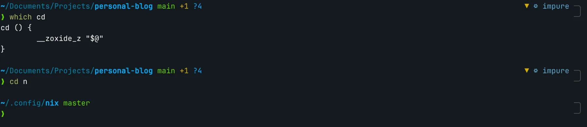
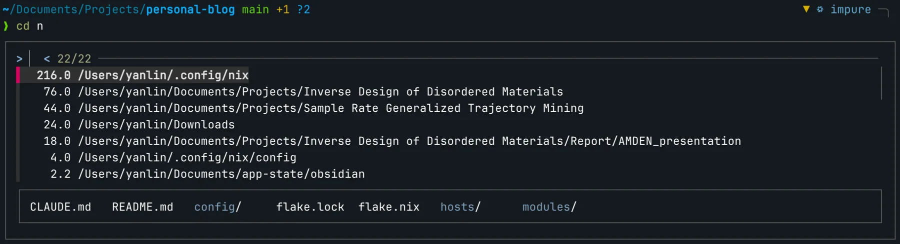
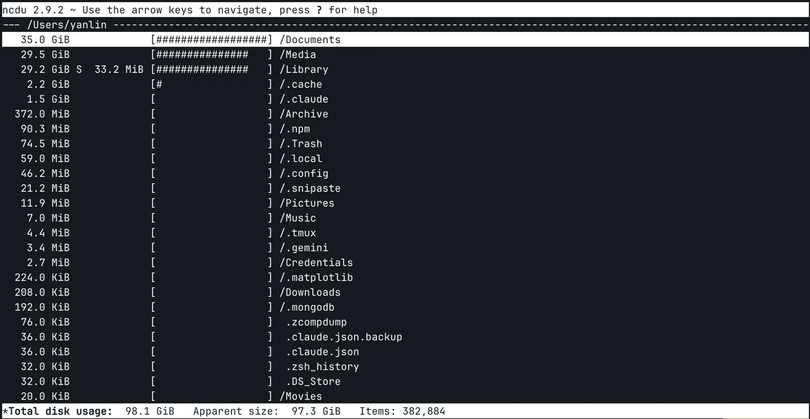
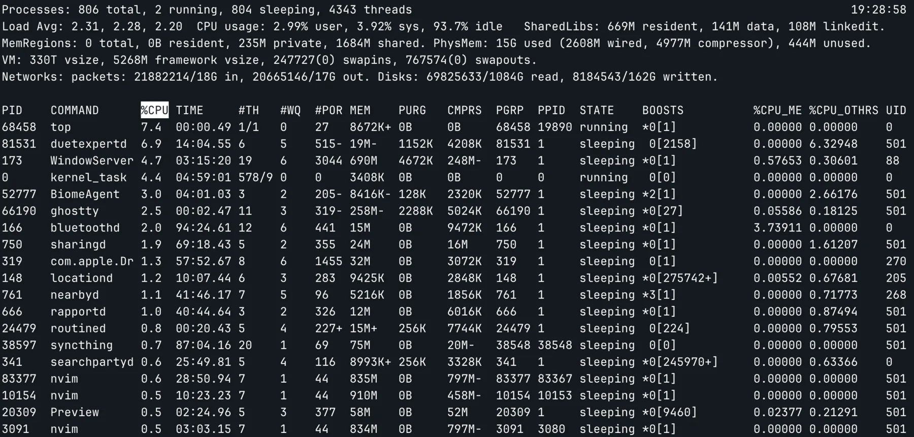
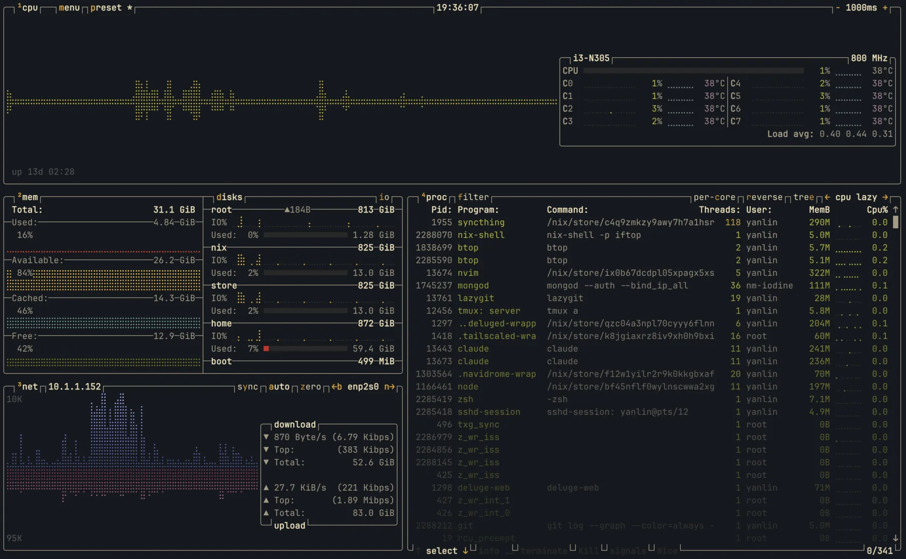
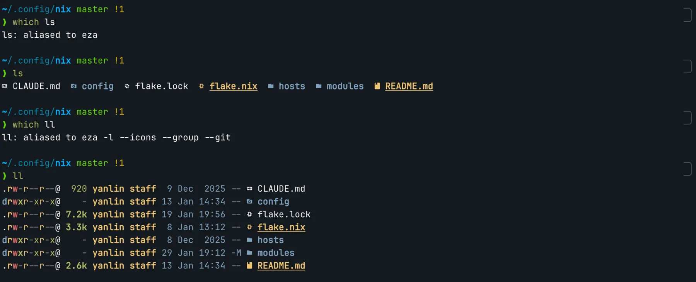
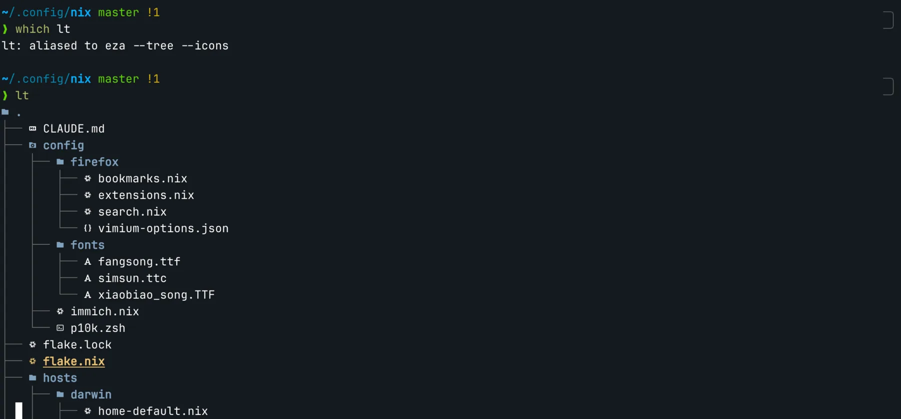
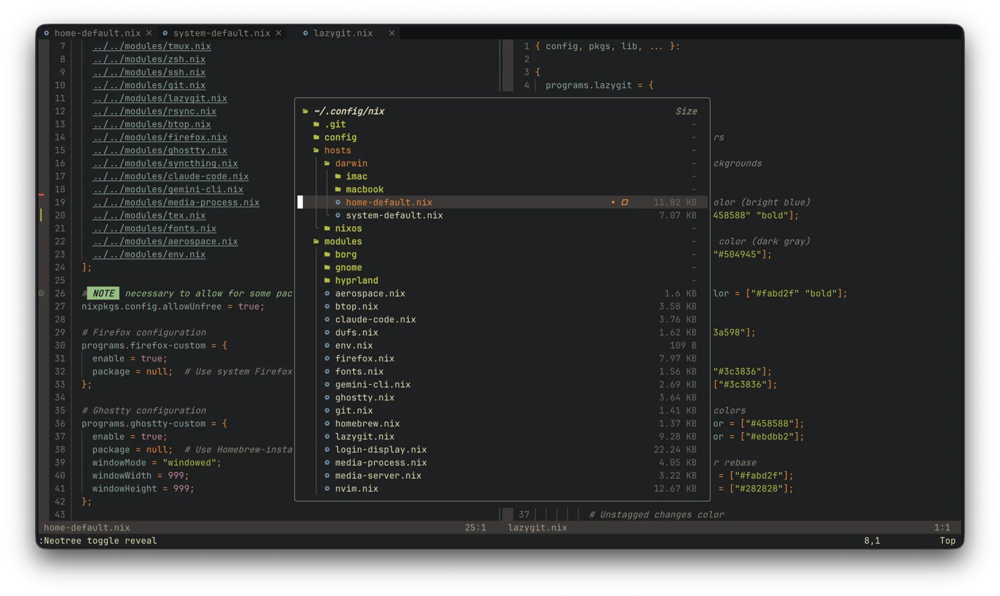
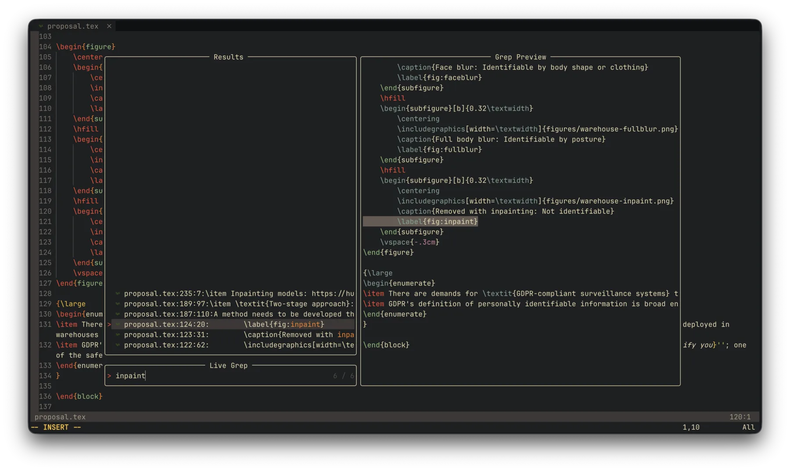

+++
title = "Modern Unix Commands"
date = 2026-01-29
description = "Modern alternatives to classic Unix commands"
+++

There might be dozens of "modern alternatives" to every classic Unix command if you look into them;
I am not a big fan of reinventing wheels, but some of these alternatives are indeed nice and more user-friendly than their classic counterparts.

## `cd` -> `zoxide`

`cd` needs the exact absolute or relative path to work. 
[`zoxide`](https://github.com/ajeetdsouza/zoxide) will remember the directories I visited, and I can quickly jump back to those directories with fuzzy path matching.

Let's say I am currently in `~/Documents/Projects/personal-blog` and I want to jump to `~/.config/nix`.
With the classic `cd`, I will have to type the whole path.
With `cd` aliased to `zoxide`, I only need to type `cd n` (supposing that `~/.config/nix` is the most frequently visited directory among all matched directories).

Internally `zoxide` records my visits to directories in a SQLite database and sorts them based on frequency. If the first hit is not what I want, I can also interactively select from the matched list.

## `du` -> `ncdu`

`du` is quite basic, and I usually need to add several arguments to make it somewhat usable. For example, `-d 1` to control the depth, `-h` to make the size human-readable.

[`ncdu`](https://dev.yorhel.nl/ncdu) is an interactive alternative to `du`, and is very usable out of the box. Interestingly, I also feel it is a touch faster than `du`.
It can totally be an alternative to those fancy disk space analyzers as well.

## `top` -> `btop`

`top` is quite basic and looks "unexciting". `htop` also ships with most Unix/Linux systems and looks better.

[`btop`](https://github.com/aristocratos/btop) might be the most "nerdy-looking" `top` alternative out of the box. It can be a handy tool if you are trying to make people believe you are a hacker.

At the same time, it is very feature-rich and configurable. To some extent, it is also an alternative to bandwidth monitoring tools like `iftop` and disk utilization tools like `df`.

## `ls` -> `eza`

I think there is nothing wrong with the classic `ls`. So, as an alternative, [`eza`](https://github.com/eza-community/eza) just has a few quality-of-life improvements, like file type icons, Git status, and (based on personal taste) prettier colors.

It can replace the `tree` command as well.

## `vim` -> `nvim`

Many people still haven't overcome the biggest `vim` challenge to this day: exit `vim` without turning off your computer.
It took me some effort to get familiar with `vim` keybindings back when I was an undergraduate, but I am definitely not going back.
You can simply use `vim` keybindings in many editors or IDEs. `vim` itself can feel a bit restrictive serving as a fully-featured code editor.

[`neovim`](https://neovim.io/) is a rabbit hole that I won't be trying to comprehensively cover in this post (nor could I).
To put it simply, it is a TUI editor that can truly be your only text editor. With countless plugins and ways to configure it, it can be a basic text editor, or a fully-featured development IDE, or anything in-between.
Syntax highlighting, file browser, fuzzy search, intelligent autocompletion, debugging, AI™ integration. You name it, `neovim` has it.

