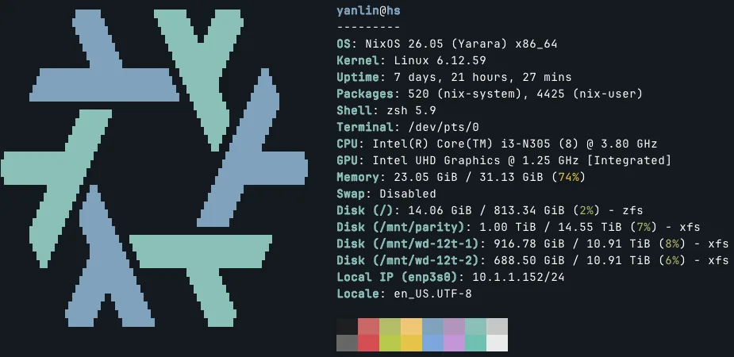
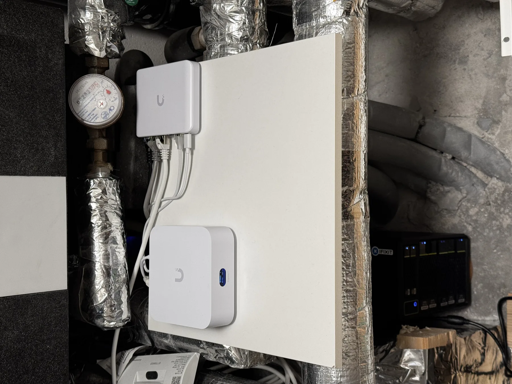
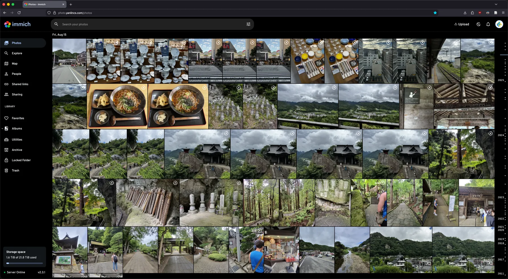
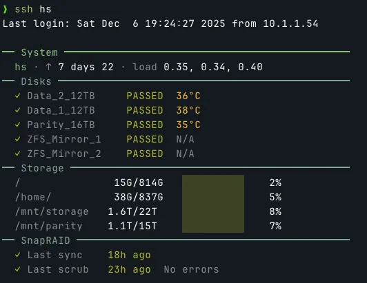

+++
title = "NixOS Home Server"
date = 2025-12-06
description = "How I built a NixOS-based Home Server/Nas"
+++

This is a very concise walkthrough of my main home server running NixOS. I assume the reader already has basic knowledge about NixOS.



> `neofetch` screen of my home server.

My home server (or many would rather call it a NAS) serves common home server purposes: bulk storage, basic file sharing, media streaming service, and photo backup.

## Physical Setup

Below is a recent photo of my home server, living in the utility closet together with my network equipments.



> Real-world photo of the home server.

It is essentially an Intel N305 custom motherboard with SATA back panel and a 3D-printed enclosure. I bought it on Taobao last time I went back to China to visit my family.
Not very important here, as long as you stick to common hardware, it should be relatively straightforward to install NixOS and replicate my setup.

## Storage

### System Root

I use two 1TB SSDs as ZFS mirror, serving as system root and storage for mission-critical files. With NixOS and [disko](https://github.com/nix-community/disko), it is fairly easy to declare such a setup.
You declare two SSDs, and then declare the ZFS mirror pool (see my [disko config file](https://github.com/Logan-Lin/nix-config/blob/master/hosts/nixos/hs/disk-config.nix)).
I do have some other configuration for ZFS service in the [system configuration file](https://github.com/Logan-Lin/nix-config/blob/master/hosts/nixos/hs/system.nix):

```nix
services.zfs = {
  autoScrub = {
    enable = true;
    interval = "monthly";
    pools = [ "rpool" ];
  };
  autoSnapshot = {
    enable = true;
    frequent = 4;
    hourly = 24;
    daily = 7;
    weekly = 4;
    monthly = 12;
  };
  trim = {
    enable = true;
    interval = "weekly";
  };
};
```

### Bulk Storage

Before switching to NixOS, my home server was running [Unraid](https://unraid.net/). I quite like the idea of a unified mounting point comprised of mixed-size disks with parity protection.
As far as I know, the closest setup on NixOS (or Linux in general) is to use [MergerFS](https://github.com/trapexit/mergerfs) and [SnapRAID](https://www.snapraid.it/), with MergerFS creating a unified mounting point for a group of disks, and SnapRAID periodically writes parity data to parity drives.
This is slightly different from Unraid where it writes parity data in real-time. But in normal home scenarios, this should be sufficient.

I didn't use disko to manage any part of my bulk storage. Instead, since I was using XFS for all my HDDs back on Unraid, I simply mount these drives (and yes, all the data is preserved) in my [system config](https://github.com/Logan-Lin/nix-config/blob/master/hosts/nixos/hs/system.nix):

```nix
fileSystems."/mnt/wd-12t-1" = {
  device = "/dev/disk/by-id/ata-HGST_HUH721212ALE604_5PK2N4GB-part1";
  fsType = "xfs";
  options = [ "defaults" "noatime" ];
};

fileSystems."/mnt/wd-12t-2" = {
  device = "/dev/disk/by-id/ata-HGST_HUH721212ALE604_5PJ7Z3LE-part1";
  fsType = "xfs";
  options = [ "defaults" "noatime" ];
};

# Parity drive for SnapRAID
fileSystems."/mnt/parity" = {
  device = "/dev/disk/by-id/ata-ST16000NM000J-2TW103_WRS0F8BE-part1";
  fsType = "xfs";
  options = [ "defaults" "noatime" ];
};
```

Then you create a MergerFS mounting point with all the data drives:

```nix
fileSystems."/mnt/storage" = {
  device = "/mnt/wd-12t-1:/mnt/wd-12t-2";
  fsType = "mergerfs";
  options = [
    "defaults"
    "allow_other"
    "use_ino"
    "cache.files=partial"
    "dropcacheonclose=true"
    "category.create=mfs"
  ];
};
```

And setup SnapRAID with the parity drive:

```nix
services.snapraid = {
  enable = true;
  
  parityFiles = [
    "/mnt/parity/snapraid.parity"
  ];
  
  contentFiles = [
    "/var/snapraid.content"
    "/mnt/parity/.snapraid.content"
    "/mnt/wd-12t-1/.snapraid.content"
    "/mnt/wd-12t-2/.snapraid.content"
  ];

  dataDisks = {
    d1 = "/mnt/wd-12t-1/";
    d2 = "/mnt/wd-12t-2/";
  };
  
  sync.interval = "02:00";
  scrub.interval = "Mon *-*-* 06:00:00";
};
```

The experience is very similar to Unraid. You and the software running on the server only have to interact with the unified mounting point `/mnt/storage`.
When writing new files, MergerFS will write the file to the drive with the most empty space.
It is very easy to add or remove drives later, and no worry about mixed size.

## File Sharing

I used to run [Nextcloud](https://nextcloud.com/) on my home server but now I don't, since I feel it is overcomplicated for my personal use. (It is nice if you want to share files publicly)
Right now for simple file sharing, I have two options: WebDAV and Samba. For both of which I wrote a custom module that can be enabled in the home server system config.

For WebDAV, I wrote [a module](https://github.com/Logan-Lin/nix-config/blob/master/modules/dufs.nix) that wraps [dufs](https://github.com/sigoden/dufs). The benefit of WebDAV is that it is HTTP-based, thus can be proxied like a website to serve files publicly.
For Samba, I have [another module](https://github.com/Logan-Lin/nix-config/blob/master/modules/samba.nix) that wraps, well, Samba. It has better performance compared to WebDAV, but cannot be proxied. Thus, if you need to access a Samba share outside of the home network, you probably will need a VPN routing back to your home LAN.

## Media Server

One of the primary purpose of my home server is to download, store, and serve (*totally legit and definitely legally obtained*) TV shows and movies.
To do so I use a common stack of media management and streaming services: [Deluge](https://deluge-torrent.org/) for download, [Servarr](https://wiki.servarr.com/) stacks ([Sonarr](https://sonarr.tv/), [Radarr](https://radarr.video/), [Lidarr](https://lidarr.audio/), and [Bazarr](https://www.bazarr.media/)) for management, and [Plex](https://www.plex.tv/) for streaming.
And they are setup by using native nix packages. I wrote a simple [media server module](https://github.com/Logan-Lin/nix-config/blob/master/modules/media-server.nix) and left some basic options for myself:

```nix
user = lib.mkOption {
  type = lib.types.str;
  default = "media";
  description = "User to run media services";
};

group = lib.mkOption {
  type = lib.types.str;
  default = "users";
  description = "Group for media services";
};

sonarr.enable = lib.mkEnableOption "Sonarr TV show management"; # port 8989
radarr.enable = lib.mkEnableOption "Radarr movie management"; # port 7878
jellyfin.enable = lib.mkEnableOption "Jellyfin media server"; # port 8096
deluge.enable = lib.mkEnableOption "Deluge torrent client"; # web port 8112
plex.enable = lib.mkEnableOption "Plex media server"; # port 32400
lidarr.enable = lib.mkEnableOption "Lidarr music management"; # port 8686
bazarr.enable = lib.mkEnableOption "Bazarr subtitle management"; # port 6767
```

And for each service, the config syntax is unified. Not much though, I just ensure all services are running with the same user/group.
It would be nice if I can declare all the configurations in Nix, but as far as I know most of the configurations are not exposed as Nix options. You need to config them in the web UI of each service.

```nix
services.sonarr = lib.mkIf cfg.sonarr.enable {
  enable = true;
  user = cfg.user;
  group = cfg.group;
  openFirewall = false;
};
```

You can also tell I tried both Jellyfin and Plex. While I really want to stick to open-source and free software, Plex's experience is simply better and just works (supposing you have the Plex pass of course, which I have the lifetime subscription).
One example is, Jellyfin's web interface has problem rendering Chinese subtitles, and I simply cannot get it to work. And Plex works perfectly out of the box.

You might also be wondering why I choose Deluge among other popular torrent client options like [qBittorrent](https://www.qbittorrent.org/) and [Transmission](https://transmissionbt.com/).
It is not straightforward to lock a specific version of software in Nix. Since qBittorrent updates quite frequently but it is kinda notorious for releasing buggy versions, the newer versions are banned by many private trackers.
Transmission seems to be more stable, but its interface is so barebones and is missing many basic features for advanced torrent management.

## Photo Backup

For photo backup I use [Immich](https://immich.app/). It is a self-hosted alternative to iCloud Photos and Google Photos. Aside from basic photo backup and management, it also has many nice touches, such as face detection, CLIP-based image embedding for semantic search, and recently added OCR for text search. It also comes with quite robust mobile apps for both iOS and Android.



> Web interface of Immich.

Right now Immich is the only service I am running with containers rather than native Nix modules (as you can see in [this configuration file](https://github.com/Logan-Lin/nix-config/blob/master/hosts/nixos/hs/containers.nix)). Technically it is possible to set up Immich with pure Nix modules, but for this type of services that rely on specific versions of databases (in this case, PostgreSQL with vector support), I feel containers are the easier route.
And to be honest, I don't think there is much benefit going with pure Nix module here (especially for Immich which you can still [declare its config](https://github.com/Logan-Lin/nix-config/blob/master/config/immich.nix) even with containers), other than fulfilling the purism many Nix users seem to have.
Also, I am not using Docker but Podman instead, which is said to have better integration with NixOS. From my experience it is fairly declarative and efficient, should be practically nearly identical to running directly on the host.

## Peripherals

### Proxy

If you take a look at [my whole Nix config repo](https://github.com/Logan-Lin/nix-config), you will notice the home server is just part of setup.
I also have a cloud VM that is running NixOS (see its [system config](https://github.com/Logan-Lin/nix-config/blob/master/hosts/nixos/vps/system.nix)). It is serving as a proxy server for all my services running on the home server, as you can see in [this configuration file](https://github.com/Logan-Lin/nix-config/blob/master/hosts/nixos/vps/proxy.nix).
My goal is to make all my services accessible without the need for VPN, so everything is proxied through this cloud VM that can be publicly accessed at subdomains of `yanlincs.com`.
This also have the added benefit that I can create public share links to send to my family/friends, for example using the Immich's built-in sharing function.
But this also means I have to set strong passwords for all my services. Forget about trying to brute force them, they are all randomly generated 40+ characters with mix of alphabet, numbers, and symbols.

### VPN

Nevertheless, I do have VPN setup on all my hosts to make things like remote access to Samba share and ssh easier. I previously used [Wireguard](https://www.wireguard.com/) and now switched to [Tailscale](https://tailscale.com/).
The reason is very similar to the Jellyfin vs. Plex situation. While Tailscale is less declarative and not fully a "free software", I am lazy and I like that Tailscale is easy to setup and have good experience on most platforms.
The P2P nature of Tailscale also means that, if you have no interest in creating public share links and are OK with always accessing your services with VPN outside your home, you don't actually need to rent a cloud VM to proxy your services.

### Health Monitor

I don't want to complicate things so I haven't set up any automated system to check the health status of my home server and send notification if anything goes wrong.
I do have a [login display module](https://github.com/Logan-Lin/nix-config/blob/master/modules/login-display.nix) that will report important status every time I SSH into my home server.



> Information displayed at `ssh` login.

## Why NixOS?

This is sort of a conclusion section.

Compared to purposefully built home server systems (like Unraid) and pre-built home server solutions (like Synology), setting up a home server from scratch using a Linux distribution like NixOS definitely requires much more prior knowledge, patience, and effort. But you get to learn lots of Sysop stuff, which for me who will be staying in the computer science domain is certainly beneficial. It also teaches you that most off-the-shelf solutions are not much more than wrappers of open-source software, and maybe let you think twice next time you are about to pay for a service. Personally, I am a masochist so I tend to go for the harder route for no practical reason.

Compared to other Linux distributions, NixOS is quite suitable for setting up a home server. Since it is declarative, setting up many things are probably easier than you thought. In other words, for the most part, you only have to care **what** you want to achieve, not **how** you are going to achieve them (this is of course, primarily thanks to the amazing NixOS community). On the other hand, most of the configuration is fully self-contained and tracked in your Nix config repo (supposing you use git). So it is much less prone to oversight during configuration, and you also don't have to explicitly remember your setup for future references. Before switching my home server to NixOS, I've been using Nix-darwin on my Macbook for a while, so I also get to reuse a lot of custom modules, like the [neovim module](https://github.com/Logan-Lin/nix-config/blob/master/modules/nvim.nix).


> Local (left) and `ssh`-connected server (right) terminal interface.
> It looks completely identical (why not), to the point I have to set up visual hints (like the highlighted tmux hostname display) to remind myself which host I am currently on.
