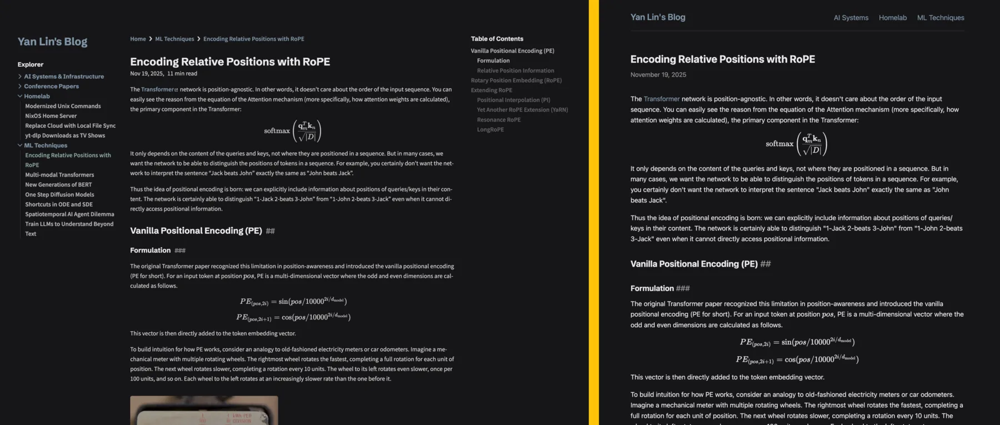
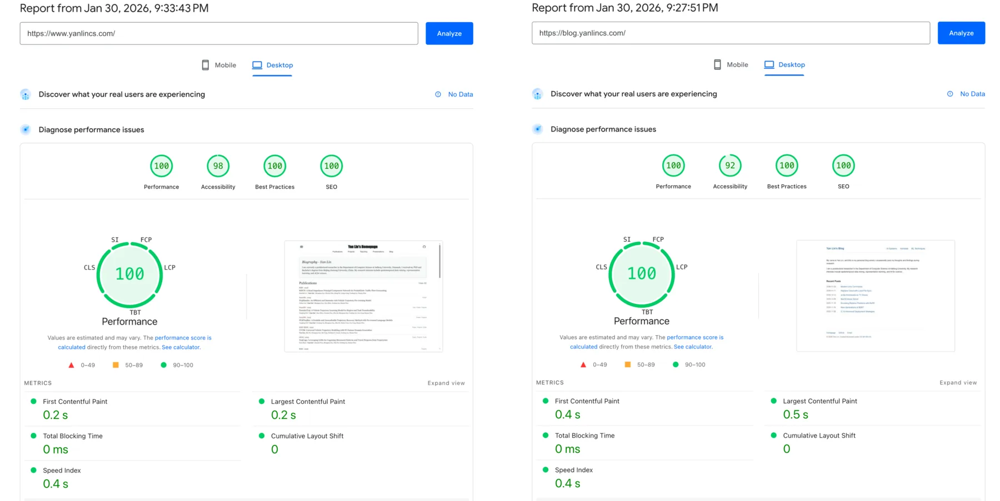

+++
title = "Refactor This Blog Site with Zola"
date = 2026-01-31
description = "Refactor this blog site with all content preserved, but much less dependency and a minimalist design"
+++

Up to yesterday morning, this blog site was generated from an Obsidian vault with [Quartz 4](https://quartz.jzhao.xyz/).
Not anymore, since last night I refactored the whole site using [Zola](https://github.com/getzola/zola), and introduced a very minimalist design.



> Comparison of how the blog site looks before (left) and after (right) the refactor.

Aside from artistic changes, the main reason behind this refactor is to use a static site generator (SSG) that has fewer dependencies and straight-forward control of templates.
I will dive deeper into the rationale and the refactor process below.

## Why Refactor?

If it ain't broke, don't fix it. Following this philosophy it is unnecessary to refactor my blog site since it is working perfectly.
But this was something that stays in my mind for quite a while and now I finally decided to do it.

Before this refactor my blog site was generated using [Quartz 4](https://quartz.jzhao.xyz/), an SSG that can turn a set of Markdown notes into static websites, particularly Obsidian-flavored Markdown with WikiLinks and callout blocks.
I will still recommend Quartz 4, if you want to quickly turn your Obsidian vault into a blog site, or if you want to build a wiki site with intertwined inner links jumping between notes. It is a free alternative to [Obsidian's official publish service](https://obsidian.md/publish) (which, aside from being overpriced in my opinion, doesn't even directly support custom domains and requires you to set up a reverse proxy for that purpose).

For my use case, I only want a basic SSG that accepts standard Markdown notes, with the only two add-ons being LaTeX math equation rendering and code block syntax highlighting. Then Quartz 4 starts to feel over-engineered and has too long a list of dependencies. It is also not straightforward to control how the generated site looks and feels, since the rendering pipeline is controlled by multiple TypeScript modules.
By the way, [my homepage](https://www.yanlincs.com/) is basically built from scratch, generated by [a simple generator](https://github.com/Logan-Lin/homepage) I wrote in Python with the Jinja 2 template engine. The generated website also has zero dependency on external JavaScript or CSS libraries, making it blasting fast to load.
Of course the purpose of this blog site is very different from my homepage, seeing that this blog site is content-heavy, while my homepage just has to display lists of publications stored in a YAML file.
Still, I always wanted this blog site to have as few dependencies as possible, and the styling to be directly controllable with HTML templates and CSS.

## Refactor with Zola

There are lots of SSGs out there claiming to be fast and flexible (like [this list](https://jamstack.org/generators/) which includes 350+ SSGs).
I choose [Zola](https://github.com/getzola/zola) to be the SSG for my refactored blog site.
To be honest I didn't perform a very comprehensive research or try out multiple SSGs myself before I made this decision.
I just remember hearing about this SSG from [this YouTube video](https://www.youtube.com/watch?v=ATenAnk8eX4). After quickly looking it up, it seems to have everything I need and is very lightweight.

My foundational framework for my blog site with Zola is quite simple.
First a `flake.nix` development environment with Zola itself.
Then a template for each type of page needed in my blog site: a base template that is shared across all pages with the navigation bar and footer, the home index page, the index page for each sub-directory (termed section), and the blog post page. Each template is just an HTML file with some Jinja2/Django syntax.
Finally a `style.scss` to make styling adjustment easy.
The result is a very minimalist-looking blog site (as you are looking right now).

Most of the heavy work during the refactor is to migrate the Markdown notes.
As I mentioned earlier, Quartz 4 takes Obsidian-flavored Markdown notes, and all my notes are first written in Obsidian then copied to Quartz 4's content directory.
To transform each note to the standard, Zola-compatible Markdown syntax, there are several things that need to be done:

1. Use TOML Frontmatter (`+++`) instead of YAML Frontmatter (`---`) for note metadata (e.g., title, create date)
2. Replace WikiLinks (`[[]]` and `![[]]`) with standard Markdown links (`` and `[]()`), for both reference to assets and inner links to other posts
3. Create a bundle (folder) for each post where the folder name is the same as the old note name; each bundle contains the note as `index.md` and the assets needed
4. Also since Obsidian's WikiLinks use shortest path (i.e., you can just use the filename without full folder path), I need to find the exact relative path of all assets and inner links, copy the assets to each bundle, and replace the shortest paths with explicit relative paths
5. Replace all callout blocks with simple Markdown blockquotes.
6. Wrap multiline LaTeX equations (those with `\\` line breaks) to prevent Zola from interpreting the line breaks.

These are all not very complex steps, but will certainly take a lot of time if I were to do it manually.
Luckily, with a command line AI agent like Claude Code that can execute commands in your terminal, I can just give the above steps as the input prompt and set the AI agent to work. 
By the way this is also the first time I tried the "dangerously skip permissions" mode of Claude Code, it works well in this case that I do not have to manually allow it executing commands like `cp` and `mv`.

I also took this opportunity to switch from GitHub Pages to Cloudflare Pages for hosting the website.
Cloudflare has built-in Zola template for page builds, but to use the latest version of Zola, I need to manually fetch the released binary using the following build command.

```bash
curl -sL https://github.com/getzola/zola/releases/download/v0.22.1/zola-v0.22.1-x86_64-unknown-linux-gnu.tar.gz | tar xz && ./zola build
```

Thanks to the fact that Zola is contained in a single binary, the build process is still relatively simple. Once setup, the deployment process is basically the same: after a commit is pushed to [this GitHub repo](https://github.com/Logan-Lin/blog), the website will be automatically rebuilt.
Compared to GitHub, Cloudflare should have a higher-performance global CDN, so the page should be faster and more stable to access, especially for my Chinese colleagues.

## Conclusion

With the help of an AI agent, I finished the whole refactor process within one night, and I am quite happy with the end result.
All the content is preserved, and all the old URLs pointing to certain blog posts will still link to the same post.

Zola itself is very lightweight. As for the generated blog site, the only external dependency is the KaTeX library for rendering LaTeX math equations. Thus, it is very fast to load, only a touch slower than my homepage.



> Load speed comparison of my homepage and the refactored blog site.
