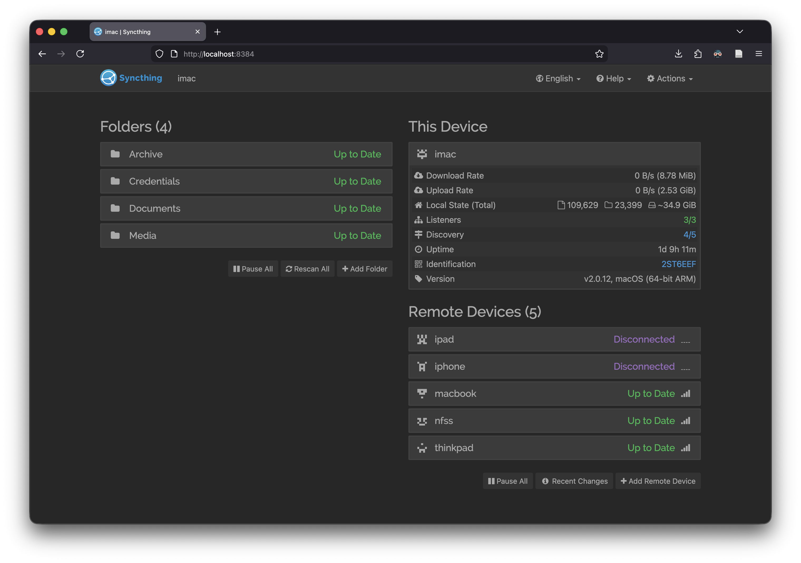
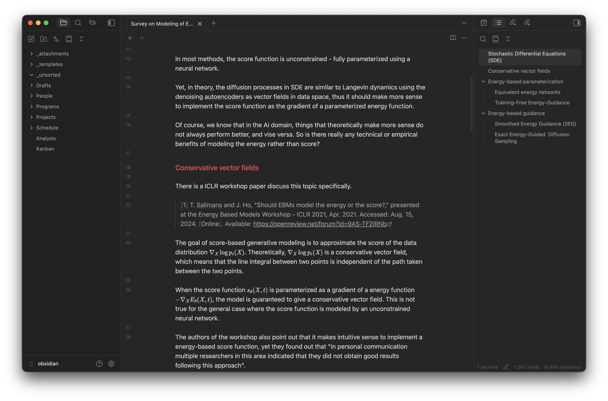
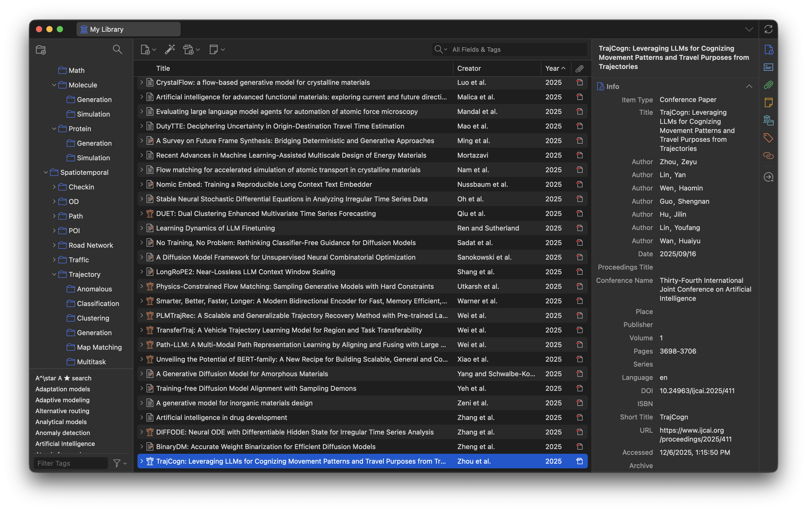
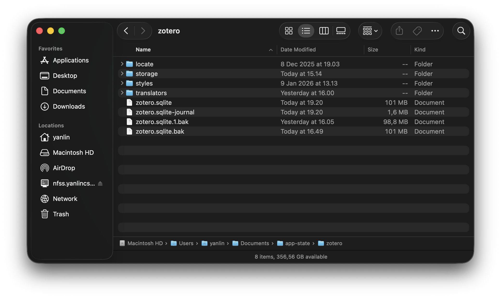
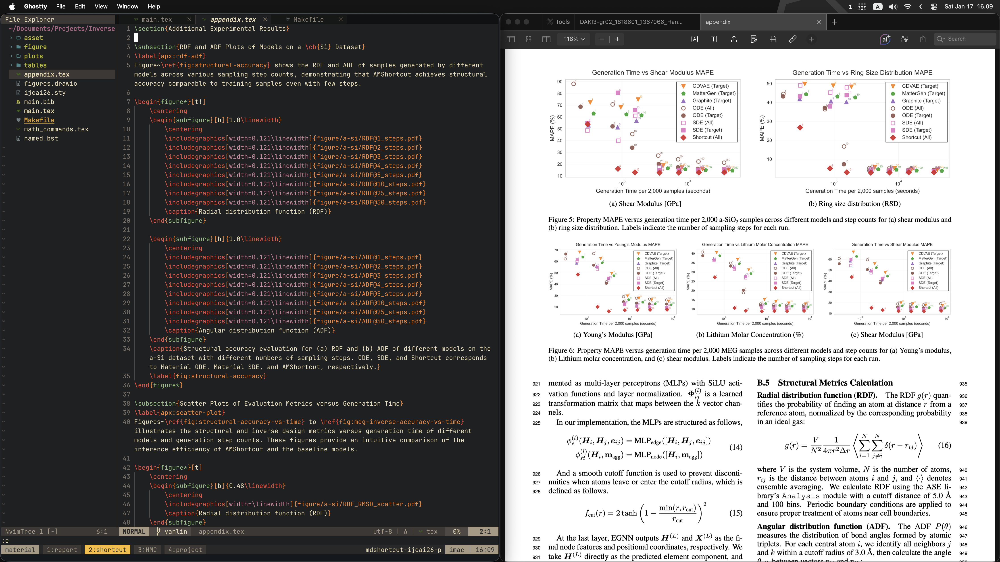
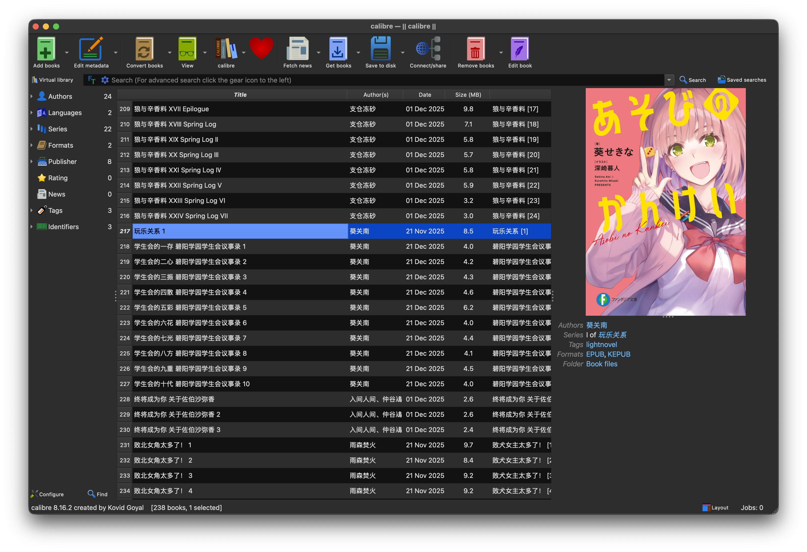

+++
title = "Replace Cloud with Local File Sync"
date = 2026-01-11
description = "Local file sync is more robust and user-friendly than cloud-based solutions, for personal use and small files at least."
+++

Most software that relies heavily on cloud infrastructure works like this: the full data is stored on the cloud, and only the data needed for now is fetched or updated by the software.

There are lots of problems with this infrastructure. 
First, it means the software cannot function without a stable internet connection. In other words, anything related to internet connection can break your software, say, for example: you are on an airplane, your internet provider breaks down, the cloud provider breaks down, your workplace faces a power outage, or your VPN connection is not stable, etc.
Second, there is no guarantee that you can always fetch the data and it is always intact. The cloud provider can block your access to the data for a variety of reasons (geopolitical regulations, policy updates, cancellation of subscription, etc.). Also, if the cloud provider gets hacked, anything can happen to the data.
In conclusion, using software that relies too much on cloud infrastructure can be annoying at best, and can cost you valuable data at worst.

I have been aware of these problems for a few years and have been actively staying away from the cloud when dealing with software and data that is mission-critical.
One simple yet extremely robust solution I hold on to is to **always prefer local file synchronization between all my computers** over relying on the cloud.
That, of course, extends to preferring software that works largely based on local file storage, rather than requiring always connected to the cloud.

## Core: A File Sync Service

A service for syncing local files between your computers is the headquarters of the action here.
As long as the service can achieve one functionality: always keep a full copy of data stored locally on each of your computers, it doesn't really matter if the service is cloud-based or not. Most cloud storage clients provide the functionality to locally cache all the data.

I do want to recommend a service for this purpose: [Syncthing](https://syncthing.net/). This is a peer-to-peer file sync service, which means it has minimal reliance on cloud infrastructure, and your data never has to be stored on computers that are not yours.
Also, from my experience, all cloud storage services I've used frequently run into stability issues when I try to sync tons of small files at once (e.g., a Git repo), but Syncthing is never unstable no matter how I abuse it.



## Examples

### Note Taking: Notion vs. Obsidian

[Notion](https://www.notion.com/) is quite a popular note taking/project management software that is basically purely cloud-based. Even their client is largely a web browser with very limited offline functionality.
You can easily see that such cloud-reliance completely blocks you from using Notion on an (not WiFi-equipped) airplane. Notion is also a prime example that the chance of cloud providers deleting your data may be low but is certainly not zero: in 2024, [Notion starts to delete Russia users' account](https://therecord.media/notion-app-leaving-russia-us-sanctions).

One replacement for Notion that has no reliance on cloud what so ever is [Obsidian](https://obsidian.md/), which for personal note taking, can replicate (and even surpass) Notion's functionalities with a little bit of setup.
Every type of data needed by Obsidian, including the notes themselves, settings, plugins, and GUI customization, are stored locally (even better, in plain text).
Once you use a local file sync service to sync the vault folder of Obsidian, it works like the cloud in that everything is always in-sync, but does not have any of the downsides of the cloud.



### Reference Management: Zotero

[Zotero](https://www.zotero.org/) is a reference management software that can be used in a variety of scenarios. For me, I largely use it to manage academic papers I need to read.



Zotero has a built-in cloud sync functionality but their price for storage upgrades is quite high. One thing you might not know is, Zotero stores metadata and attachments in the same folder. You can use Syncthing to sync that folder, and completely ignore the official cloud sync functionality.



### Paper Writing: Overleaf vs. Local Text Editor

If you work in academia, chances are you have used or at least heard of [Overleaf](https://www.overleaf.com). It is an online platform for working with LaTeX documents. Most of my colleagues use it heavily for writing academic papers.
Similar to Notion, the more you use Overleaf heavily, the more annoying it can become. As soon as your internet connection is not perfect, you will face interruption in your paper writing, and even lose a few minutes of work.
I also witnessed a recent incident where Overleaf was completely down for a few hours just one day before the submission deadline of an academic conference, and during that I was shocked to realize that many people only have one copy of all their academic works stored on Overleaf. You can easily see what kind of disaster this could lead to.

If you are not using Overleaf's real-time collaboration functionality, the whole workflow of preparing LaTeX documents can easily be replaced by any local text editor with a TeX runtime.
Many people would prefer specially designed editors like [TeXstudio](https://texstudio.org/) or VSCode with the [LaTeX Workshop plugin](https://marketplace.visualstudio.com/items?itemName=James-Yu.latex-workshop) where you get handy features like jumping between corresponding positions of the source file and the rendered PDF.
What I like to do is to write a `Makefile` if there are any special arguments needed to compile my LaTeX document (like the one below), so I can recompile it with a single `make` command.

```Makefile
.PHONY: all clean

all: main.pdf

main.pdf: main.tex appendix.tex main.bib
	latexmk -pdf -bibtex -shell-escape -interaction=nonstopmode -output-directory=out main.tex
	cp out/main.pdf ./

clean:
	rm -rf out
```



Overleaf also provides two types of Git integration for you to sync your local changes with Overleaf projects: sync with a GitHub repo, or directly as a remote git repo. It's totally viable to have a mixed setup, where you primarily use local editors and most of your collaborators use Overleaf.

### Book Management: Calibre

[Calibre](https://calibre-ebook.com/) is a book management software that can be used to manage your book collection, edit metadata, along with many handy functionalities like bulk conversion.



Similar to Zotero, Calibre stores all the books and metadata of a library in a local folder, so there is nothing stopping you from syncing the folder across multiple computers. Although this is something explicitly suggested against by the software (a line when you select the location for a library: "Note that putting the calibre library on a Networked drive is not safe"), from my experience, as long as you don't try to open and modify the same library on two synced computers simultaneously, you won't be running into any issues.

### Music Player: Plexamp vs. foobar2000

For music playback, I used to set up a Plex media server, create a music library, and use Plex's dedicated music client ([Plexamp](https://www.plex.tv/plexamp/)) on my phone. (See [this blog post](/homelab/nixos-home-server))
This infrastructure is very similar to music streaming services like Apple Music and Spotify, except I have all the unencrypted music files.
It is my own cloud infrastructure, nevertheless it is a cloud infrastructure so still has many problems of the cloud.

Now I use a simpler yet more robust setup. I just sync all my music files in a folder through Syncthing, and use a local music player like [foobar2000](https://www.foobar2000.org/) to read that folder.
Of course, to save some space, I will always transcode each file to AAC 256k before putting them in the sync folder.


## Limitations

There are limitations of a local file sync setup, and I admit in some cases the cloud solution is indeed better.

One of them is when you need team collaboration. I would argue that local file-based collaboration is certainly technically possible, for example through a remote Git repo. But in practice, it is quite hard to persuade all your team members switching to a local file setup, compared to just an online share link. 

Another thing is that all your synced computers need to have enough space for storing all the data, which means the files you are syncing usually need to be relatively small files, like those we mentioned above.
For example, for TV shows and movies, you probably need to go for cloud solutions like public streaming services or running private media servers like Plex and Jellyfin on a home server with a few hard drives. Your PC and smartphones probably don't have a few terabytes to store your whole movie collection.
