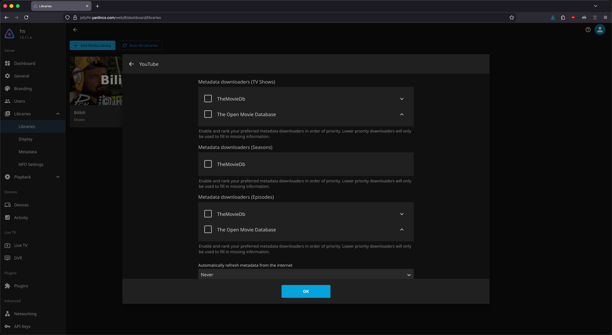
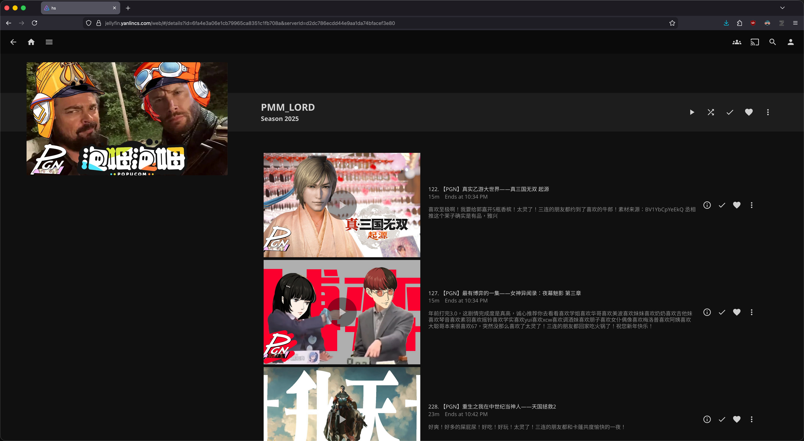

+++
title = "yt-dlp Downloads as TV Shows"
date = 2025-12-10
description = ""
+++

> **TL;DR:**
> With a Nix module, I customize yt-dlp to download YouTube/Bilibili videos and arrange the files that can be recognize by Jellyfin/Emby as "TV shows".

I like to archive high-quality videos from YouTube and Bilibili. Not that I really fear they might be taken down. For videos I like to watch, I've never encountered that situation. The main reason is for videos that I would like to re-watch quite frequently, not having to dig them from the original website is more convenient.

You probably know for downloading videos from mainstream video platforms, there is this handy command line tool called [yt-dlp](https://github.com/yt-dlp/yt-dlp). Even if you haven't heard of it, essentially most of the GUI video download programs are using yt-dlp under the hood. It is quite reliable, as long as you always have the latest version.

By default yt-dlp downloads videos from a given channel/playlist as plain video files. I have a home server, I like to watch videos on TV, and I use a stack of private media servers (Plex/Jellyfin/Emby, see [this post](@/homelab/nixos-home-server/index.md)) that are the primary services I use on the TV. Intuitively I would like to integrate the videos downloaded by yt-dlp to those servers.

To begin, while I quite like using Plex for "real" movies/TV shows/music streaming, it is not suitable for this scenario. Jellyfin/Emby is the way to go. For those two servers to properly recognize a collection of videos as a TV show, you just need two things.

**First, file naming and arrangement.** As noted in the [official guide](https://jellyfin.org/docs/general/server/media/shows/), a TV show should be organized into the following structure.

```
Series Name A
├── Season 1
│   ├── S01E01.mkv
│   ├── S01E02.mkv
│   └── S01E03.mkv
└── Season 2
    ├── S02E01.mkv
    ├── S02E02.mkv
    └── S02E03.mkv
```

**Second, optional `.nfo` files.** There can be a `.nfo` file for each show, season, and episode recording corresponding information.

The first requirement is quite easy to implement using yt-dlp's built-in template functionality. I designed the template so that the upload year will be the season number, and upload month+day will be the episode number.

```
output_template="$DOWNLOAD_DIR/$platform_name/%(uploader|Unknown)s/Season %(upload_date>%Y|0000)s/S%(upload_date>%Y|0000)sE%(upload_date>%m%d|0000)s - %(title)s.%(ext)s"
```

For example, below is the file structure you will get from a channel download.

```
Kitboga
├── Season 2020
│   ├── S2020E1021 - This Must Be Really Embarrassing, Jay Anderson ：).mp4
│   └── S2020E1025 - Scammer Helps Me Prank Other Scammers.mp4
└── Season 2021
    ├── S2021E0513 - When Scammers See $2,100,000 In Your Bank.mp4
    └── S2021E0515 - This Clueless Scammer Went Crazy After 4 Hours.mp4
```

For the second requirement, yt-dlp has a built-in video metadata extracting functionality, but it writes them into JSON files. We can define logic to parse those JSON files and write the corresponding `.nfo` files:

```zsh
_generate_jellyfin_nfo() {
  local filepath="$1"
  [[ -z "$filepath" ]] && return 1

  local dir=$(dirname "$filepath")
  local basename=$(basename "$filepath")
  local name_noext="${basename%.*}"
  local season_dir="$dir"
  local series_dir=$(dirname "$season_dir")
  local json_file="$dir/$name_noext.info.json"

  [[ ! -f "$json_file" ]] && return 1

  local title=$(jq -r '.title // "Unknown"' "$json_file")
  local description=$(jq -r '.description // ""' "$json_file" | head -c 2000)
  local upload_date=$(jq -r '.upload_date // ""' "$json_file")
  local uploader=$(jq -r '.uploader // "Unknown"' "$json_file")

  local season_num=""
  local episode_num=""
  local aired_date=""
  if [[ ${#upload_date} -eq 8 ]]; then
    season_num="${upload_date:0:4}"
    episode_num="${upload_date:4:4}"
    aired_date="${upload_date:0:4}-${upload_date:4:2}-${upload_date:6:2}"
  fi

  # XML escape special characters
  description=$(echo "$description" | sed 's/&/\&amp;/g; s/</\&lt;/g; s/>/\&gt;/g')
  title=$(echo "$title" | sed 's/&/\&amp;/g; s/</\&lt;/g; s/>/\&gt;/g')
  uploader=$(echo "$uploader" | sed 's/&/\&amp;/g; s/</\&lt;/g; s/>/\&gt;/g')

  local nfo_file="$dir/$name_noext.nfo"
  cat > "$nfo_file" << EPISODENFO
<?xml version="1.0" encoding="UTF-8"?>
<episodedetails>
  <title>$title</title>
  <season>$season_num</season>
  <episode>$episode_num</episode>
  <aired>${aired_date:-}</aired>
  <plot>$description</plot>
</episodedetails>
EPISODENFO

  if [[ ! -f "$series_dir/tvshow.nfo" ]]; then
    cat > "$series_dir/tvshow.nfo" << TVSHOWNFO
<?xml version="1.0" encoding="UTF-8"?>
<tvshow>
  <title>$uploader</title>
  <plot>Videos from $uploader</plot>
</tvshow>
TVSHOWNFO
  fi

  if [[ ! -f "$season_dir/season.nfo" ]] && [[ -n "$season_num" ]]; then
    cat > "$season_dir/season.nfo" << SEASONNFO
<?xml version="1.0" encoding="UTF-8"?>
<season>
  <title>Season $season_num</title>
  <seasonnumber>$season_num</seasonnumber>
</season>
SEASONNFO
  fi

  # Handle thumbnail: rename and copy as posters
  local thumb_file=""
  for ext in jpg webp png; do
    if [[ -f "$dir/$name_noext.$ext" ]]; then
      thumb_file="$dir/$name_noext.$ext"
      break
    fi
  done

  if [[ -n "$thumb_file" ]]; then
    local thumb_ext="${thumb_file##*.}"
    mv "$thumb_file" "$dir/$name_noext-thumb.$thumb_ext" 2>/dev/null

    if [[ ! -f "$series_dir/poster.jpg" ]] && [[ ! -f "$series_dir/poster.webp" ]] && [[ ! -f "$series_dir/poster.png" ]]; then
      cp "$dir/$name_noext-thumb.$thumb_ext" "$series_dir/poster.$thumb_ext"
    fi

    if [[ ! -f "$season_dir/poster.jpg" ]] && [[ ! -f "$season_dir/poster.webp" ]] && [[ ! -f "$season_dir/poster.png" ]]; then
      cp "$dir/$name_noext-thumb.$thumb_ext" "$season_dir/poster.$thumb_ext"
    fi
  fi
}
```

I also include the thumbnail extraction logic in the implementation. The end result is, we will have a `.nfo` file and a thumbnail image coupled with each episode, season, and show.

```
PMM_LORD
├── poster.jpg
├── Season 2025
│   ├── poster.jpg
│   ├── S2025E1031 - 【PGN】狐狸鸣泣之时——寂静岭f.mp4
│   ├── S2025E1031 - 【PGN】狐狸鸣泣之时——寂静岭f.nfo
│   ├── S2025E1031 - 【PGN】狐狸鸣泣之时——寂静岭f-thumb.jpg
│   ├── S2025E1127 - 【PGN】卡洛斯传奇略人区——宝可梦传说ZA.mp4
│   ├── S2025E1127 - 【PGN】卡洛斯传奇略人区——宝可梦传说ZA.nfo
│   ├── S2025E1127 - 【PGN】卡洛斯传奇略人区——宝可梦传说ZA-thumb.jpg
│   └── season.nfo
└── tvshow.nfo

```

And the episode `.nfo` file will record the title, upload date, and video description as the "plot".

```xml
<?xml version="1.0" encoding="UTF-8"?>
<episodedetails>
  <title>【PGN】卡洛斯传奇略人区——宝可梦传说ZA</title>
  <season>2025</season>
  <episode>1127</episode>
  <aired>2025-11-27</aired>
  <plot>臭外地的来密阿雷要饭了
谁还有多余队长！
太灵了！三连的朋友都吃上了可颂咖喱！</plot>
</episodedetails>
```

Finally, in Jellyfin/Emby, we can set up a "TV show" type library, but uncheck all the metadata fetching sources so that the information will only be provided by the `.nfo` files.



And it works!



And of course it also works nicely with third-party clients like Infuse on my mobile devices/TV.


I packaged all my custom implementation of yt-dlp into a Nix module, which you can take a look in the [this link](https://github.com/Logan-Lin/nix-config/blob/master/modules/yt-dlp.nix) if interested.
