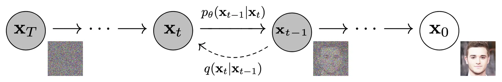
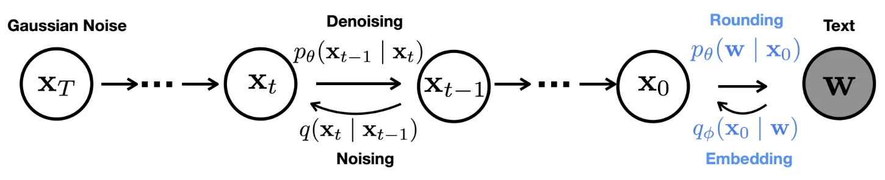
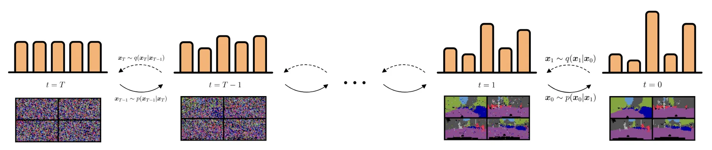

+++
title = "Diffusion Models in Discrete Space"
date = 2026-02-07
description = ""
+++

> **Disclaimer:**
> This post won't dive deep into the nitty-gritty of diffusion models (e.g., noise schedules, re-parameterization of scores, difference between flow matching and score matching, etc.). It will focus on the high-level idea of how to adapt diffusion models to discrete space to build a generative model for discrete data.
> Also, I will be primarily using diffusion model/score-matching-flavored rather than flow matching-flavored terminology.

At this point you probably are very familiar with how diffusion models or score/flow matching models work in general.
Just in case, diffusion models generate data following a target distribution through a multi-step Markov denoising process, where the model starts with random noise and gradually removes noise until clean data is reached.
For the purpose of training the model a noising process is also used, which adds noise to clean data, and the two processes are conceptually invertible with regard to each other.
[This post](../ode-sde) discussed the differential equation view of diffusion models: they are learning a time-continuous map from noise to data.

The noising and denoising process illustrated in DDPM [1].

"Adding noise" in practice typically means sampling a certain magnitude of Gaussian noise and adding it to the data features.
Obviously this only works on continuous features.
What if we want to adapt diffusion models to data with discrete features?

## Latent Diffusion Models

The diffusion process of Diffusion-LM [2] that works on the embedding space of discrete features.

The most straight-forward way to adapt diffusion models to discrete features is to encode them to continuous space, use standard diffusion models on the continuous features, and decode the continuous features back to discrete ones.
Both the encode and the decode processes can be learned or non-learned.

More specifically, suppose you have a clean state $X_0$ composed of discrete features. Using an encoder that maps discrete features to continuous embeddings, you get a continuous latent representation $E_0$ of $X_0$. Then the forward and backward diffusion process is fully done on $E_t$.
For inference, the reverse diffusion process produces a clean $\hat E_0$, and you can decode it back to discrete space and get $\hat X_0$.

The encoder and decoder can be as simple as a onehot embedding and an $\arg \max$, respectively.
Alternatively, one can use a learned lookup table embedding layer for the encoder, and a classification head for the decoder.

> There are some technical tricks out there that can improve performance or stability. For example, instead of following DDPM and parameterize the reverse diffusion process with noise predicted by a denoiser network, one can train the network to predict $\hat E_0$ given $E_t$ at any step $t$, which makes it easier to impose constraints on $\hat E_0$ and $\hat X_0$.
> During inference, at each step, one can clamp the predicted $\hat E_0$ to its closest embedding vector in the lookup table, so that the inference is explicitly geared towards producing meaningful embedding vectors.

Since the encode and decode processes and the diffusion process are largely disentangled, following this framework, one can technically use any standard diffusion models to deal with data with discrete features.
At the same time this would create a gap between the training of the diffusion models versus the final output target, which intuitively won't be the most natural and best performing way to adapt diffusion models to discrete features.

## Diffusion on Categories

Illustration of diffusion processes operating on categorical distributions.

There are diffusion models that operate directly on the discrete space [3, 4], in other words, they are trying to build a pair of Markov processes that manipulate category labels directly.

To simplify, let's suppose a data point $x$ just contains one category label.
During the forward diffusion process, given the clean $x_0$, "adding noise" to calculate $x_t$ is implemented as either (a) staying at the current label with a probability $\beta_t$, or (b) switching to another category with a probability $1-\beta_t$.

> Case (b) can be simply randomly picking a category from a uniform distribution, or it can be more complex following a specific noise schedule, leaning more heavily towards certain categories depending on the step $t$.

During the reverse diffusion process, given $x_t$, a network predicts a distribution over categories $p_\theta(x_{t-1}|x_t)$, and the process can move forward by one step by sampling from this distribution to get $\hat x_{t-1}$.

For training, one can re-parameterize $\hat x_{t-1}$ by letting the network predict the categorical distribution of $\hat x_0$, so that the output layer of the network is essentially a classification head, and the network can be trained with cross-entropy loss.

### Score-matching on Categories

Building on the above general framework, SEDD [6] frames the reverse process and trains the denoiser differently. Recall in standard score-matching [5], each reverse step follows:

$$x_{t-\Delta t} = x_t + \nabla_{x_t} \log p_t(x_t) \cdot \Delta t$$

where $\nabla_{x_t} \log p_t(x_t)$ is the score, intuitively the direction towards higher density (closer to the target distribution) at $x_t$.

SEDD defines an analogous score in discrete space. Given $x_t$, the discrete score for each category $c$ is formulated as $p_t(c)/p_t(x_t)$, measuring how strongly $x_t$ should jump towards category $c$ at time $t$ to get closer to the target data distribution.

A network is trained to estimate this score, just like in score-matching: s_\theta(x_t, t)_c\approx p_t(c)/p_t(x_t). In practice one would use $p_{t|0}(c \mid x_0) / p_{t|0}(x_t \mid x_0)$ as the training target, which is easy to compute given a known $x_0$ and the noise schedule.

On each reverse step, the probability of sampling each category for the next step follows a similar formulation as the score-matching reverse step:

$$p(x_{t-\Delta t} = c) = \delta_{x_t}(c) + \Delta t \cdot Q_t(x_t, c) \cdot s_\theta(x_t, t)_c$$

The first term is the probability of staying at the current category, and the second term is the probability of jumping to category $c$, scaled by the step size. $Q_t(x_t, c)$ is the noise factor given the specific noise schedule.

### ODE Flow on Categories

Within the above frameworks, during inference you sample from a categorical distribution to get the cleaner step.

If you want no stochasticity in the sampling steps, similar to how you would use flow matching ODE instead of score-matching SDE, you can use discrete flow [7]. The key difference is that instead of sampling from a distribution, you use $\arg \max$ to deterministically pick the category for the cleaner step.

Of course $\arg \max$ is non-differentiable, so you cannot directly train a model on its output. A trick to bypass this is to backpropagate through a softmax with low temperature instead, which approximates $\arg \max$ while remaining differentiable. The true $\arg \max$ is still used during inference.

> **References:**
> 1. Ho, Jonathan, Ajay Jain, and Pieter Abbeel. “Denoising Diffusion Probabilistic Models.”
> 2. Li, Xiang Lisa, John Thickstun, Ishaan Gulrajani, Percy Liang, and Tatsunori B. Hashimoto. “Diffusion-LM Improves Controllable Text Generation.”
> 3. Hoogeboom, Emiel, Didrik Nielsen, Priyank Jaini, Patrick Forré, and Max Welling. “Argmax Flows and Multinomial Diffusion: Learning Categorical Distributions.”
> 4. Austin, Jacob, Daniel D. Johnson, Jonathan Ho, Daniel Tarlow, and Rianne van den Berg. “Structured Denoising Diffusion Models in Discrete State-Spaces.”
> 5. Song, Yang, Jascha Sohl-Dickstein, Diederik P. Kingma, Abhishek Kumar, Stefano Ermon, and Ben Poole. “Score-Based Generative Modeling through Stochastic Differential Equations.”
> 6. Lou, Aaron, Chenlin Meng, and Stefano Ermon. “Discrete Diffusion Modeling by Estimating the Ratios of the Data Distribution.”
> 7. Tran, Dustin, Keyon Vafa, Kumar Agrawal, Laurent Dinh, and Ben Poole. “Discrete Flows: Invertible Generative Models of Discrete Data.”

